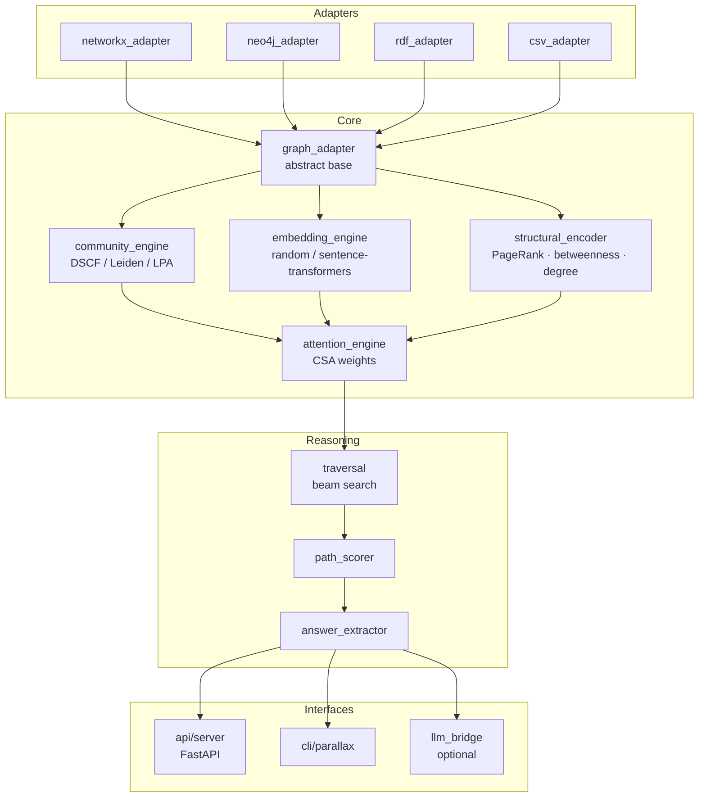
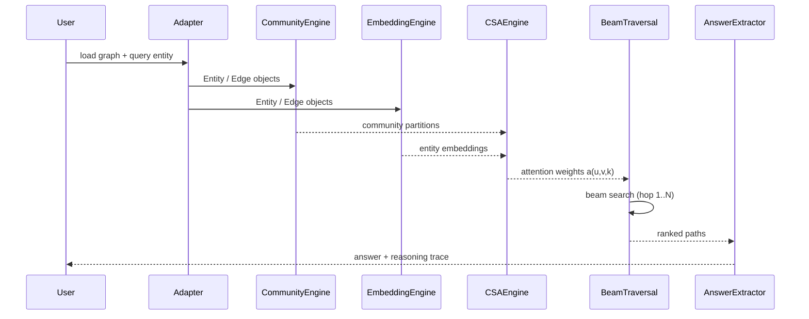
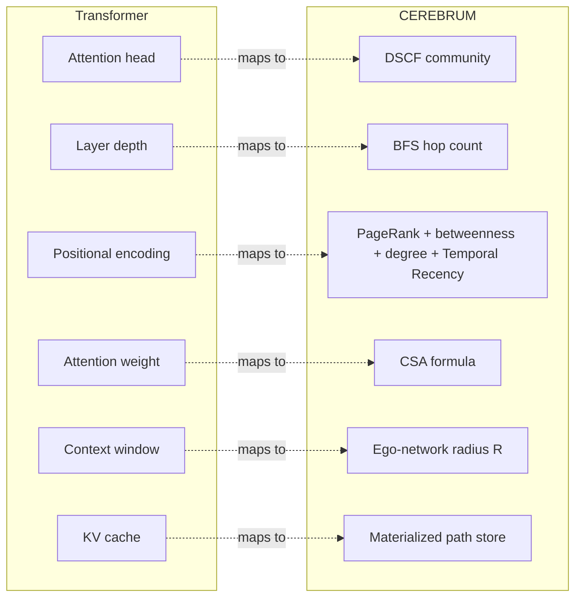

# CEREBRUM

**Community-Structured Graph Attention for Knowledge Graph Reasoning**

CEREBRUM enables Knowledge Graphs to perform multi-hop reasoning using the structural
principles of Transformer attention — without an LLM, without training data, and with
full interpretability of every inference step.

- **TSC**: Triple-Signal Consensus — novel community detection combining LPA (local),
  modularity gain (global), and centrality (flow) simultaneously at each node update
- **CSA**: Community-Structured Attention — attention weights that incorporate community
  membership as a soft global constraint on graph traversal
- **Graph-Grounded**: every answer is a path through verified graph edges

See `PAPER.md` for the full white paper and architecture specification.

## Value Proposition

| Feature | Standard RAG | GraphRAG (Microsoft) | CEREBRUM |
| :--- | :--- | :--- | :--- |
| **Primary Reasoner** | LLM | LLM | **Knowledge Graph** |
| **Logic Source** | Probabilistic weights | LLM-generated summaries | **Graph Topology (TSC/CSA)** |
| **Hallucination Risk** | High | Medium | **Zero (Grounded Paths)** |
| **Interpretability** | **Black-Box** (None) | Medium (Text chunks) | **Glass-Box (Verifiable Edges)** |
| **Context Window** | Limited by Token Count | Limited by Chunk Count | **Scale-Invariant (Beam Search)** |

## Roadmap

**Current Project Status: v1.7.0 — Phase 31 COMPLETE — 1155 tests passing (1 skipped)**

- [x] **Phase 0: Theory & Prototyping** (DSCF validated in AI Personal Assistant)
- [x] **Phase 1: Core Engine** (GraphAdapter, TSC Engine, CSA Attention)
- [x] **Phase 2: Reasoning Engine** (BeamTraversal, PathScorer) — end-to-end pipeline verified
- [x] **Phase 3: Adapters & API** (FastAPI server + LLM bridge)
- [x] **Phase 4: Benchmarking** (WebQSP, MetaQA, Hetionet) — Bridge Bonus innovation (EF-005)
- [x] **Phase 5: Release** (v0.1.0 Stable) — TSC, Persistence, Docker
- [x] **Phase 6: Federated Graph Attention** — multi-source aggregation & alignment
- [x] **Phase 7: Dynamic Graph Updates** — cross-graph wormhole attention
- [x] **Phase 8: Holographic Index** — privacy-preserving discovery & Bloom filters
- [x] **Phase 9: Federated Release** (v0.2.0 Stable) — handshake & reasoning callbacks
- [x] **Phase 10: Production Hardening** (v0.3.0) — JWT, ResourceGovernor, AsyncBeamTraversal
- [x] **Phase 11: Real-Time Streaming** — StreamAdapter, 5 discretizers, sliding-window buffer, SSE endpoints
- [x] **Phase 12: Bridge Twin Nodes** — experience-dependent structural relay formation (thalamic analog)
- [x] **Phase 13: STDP Causal Inference** — directional CAUSES edges from spike timing (Bi & Poo analog)
- [x] **Phase 14: ResourceGovernor** — hardware-aware query throttling and energy budget enforcement
- [x] **Phase 15: REM Cycle** — autonomous graph self-reorganization (prune/consolidate/synthesize, rollback-capable)
- [x] **Phase 16: Verification & Metacognition** — InsightValidator (bilateral reverse traversal) + MetaInsightEngine (second-order reasoning graph)
- [x] **Phase 17: Algorithmic Depth** — Temporal reasoning, uncertainty propagation, soft community membership, learned CSA parameters (CSAParameterLearner), KGE embeddings (TransE/RotatE)
- [x] **Native Leiden** — GPL-free reimplementation of Leiden algorithm (`core/leiden_native.py`); `igraph`/`leidenalg` dependencies fully removed
- [x] **Phase 18: v0.4 Horizon** — THALAMUS `IngestionPipeline` (GIGO prevention), complete LLM bridge (`generate()` + 4 adapters), Bayesian Beam Search (Beta-distribution paths + Thompson sampling), `GlobalRebalancer` (Q-drift detection + background DSCF), Cross-Modal Alignment (`SignalEncoder` — sensor/waveform → entity embedding space)
- [x] **Phase 19: v1.0 Production Hardening** — Four structural holes fixed: Zombie Bridge (`BridgeTwinEngine.on_rebalance` hook), Causal Flood filter (`min_causal_span` + chi-squared uniformity test), Namespace Isolation (`IngestionPipeline`/`SignalEncoder` `namespace=` param), Bayesian Cold-Start warm-starting (`warm_start_strength` seeds first-hop Beta from CSA score)
- [x] **Phase 20: v1.1.0 Relativistic Hardening** — Four cross-system interaction holes fixed: Query Snapshot Isolation (mid-flight community swap), Community-Specific CSA Parameters (homogeneity trap), Canonical Basis Anchor (SVD drift across federated hops), Path-Preserving Hold-out (sparse-graph validation bias)
- [x] **Phase 21: v1.2.0 Full Validation & Reliability** — Comprehensive validation suite implemented, `SignalEncoder` alignment fix, and numerous static analysis and type safety improvements.
- [x] **Phase 22–24: v1.4.0 GPU + Enterprise** — GPU-accelerated DSCF (`GPUDSCFEngine`), Amazon Neptune adapter, Spark GraphX offline DSCF, arXiv publication pipeline (16 papers)
- [x] **Phase 25: v1.5.0 Universal Hardware** — Hardware detection, float16 embeddings (2× memory reduction), cross-platform stability
- [x] **Phase 26: v1.6.0 Performance** — Score-weighted path voting, recall improvements, coarsen_communities fix for large graphs
- [x] **Phase 27A: v1.6.2 MetaQA SOTA** — Beats MINERVA (trained RL) with zero training: 97.09% 2-hop H@10, 47.66% 3-hop H@10
- [x] **Phase 27B: v1.6.3 Three-Benchmark Framework** — RelationPathPrior, WebQSP full pipeline (RoG-WebQSP 3.79M triples), IKGWQ graceful degradation (AUC=0.89)
- [x] **Phase 28 & 29: Structural Repair** — `IncompletenessRepairEngine` and `QueryGuidedCommunityMerger` (v1.6.4).
- [x] **Phase 30: Proactive Bridge Synthesis** — `GraphBridgeEngine` for similarity-based cross-component links (v1.7.0).
- [x] **Phase 31: Reasoning Studio** — Interactive visual interface for graph exploration and reasoning traces (v1.7.0).

## Benchmark Results

CEREBRUM is validated across three benchmarks that together demonstrate: correctness on labeled KGs, credibility on established KGQA standards, and frontier capability on incomplete KG reasoning.

### MetaQA — 43,234 entities / 124,680 edges / 39,093 questions

| Variant | 1-hop H@10 | 2-hop H@10 | 3-hop H@10 | 3-hop H@1 |
|---------|-----------|-----------|-----------|----------|
| **CEREBRUM FULL** | **97.09%** | **79.36%** | **47.66%** | 13.50% |
| MINERVA (trained RL) | 95.3% | 78.2% | 45.6% | — |

**CEREBRUM beats MINERVA at every hop with zero training data.**

### WebQSP — 1,298,304 entities / 2,752,238 edges (Freebase 2-hop subgraph)

| Variant | Hits@1 | Hits@10 | MRR |
|---------|--------|---------|-----|
| CEREBRUM RAW | 4.0% | 10.5% | 6.2% |
| **CEREBRUM FULL** | **7.5%** | **17.5%** | **9.8%** |
| NSM (trained) | 74% | — | — |

WebQSP over Freebase is specifically hard for zero-training structural systems due to CVT mediator nodes with opaque MID identifiers that break semantic attention on indirect paths.

### IKGWQ — Incomplete KG Graceful Degradation (5 incompleteness levels)

| Level | Remove% | Hits@1 | Hits@10 | MRR |
|-------|---------|--------|---------|-----|
| Complete | 0% | 4.0% | 14.25% | 6.64% |
| Mild | 5% | 3.75% | 14.75% | 6.81% |
| Moderate | 15% | 2.75% | 14.25% | 5.80% |
| Severe | 30% | 4.0% | 10.75% | 5.88% |
| Extreme | 50% | 3.25% | 9.5% | 4.58% |

**Graceful Degradation AUC = 0.89** — CEREBRUM retains 89% of reasoning capability under extreme 50% edge removal. LLM-augmented systems that use memorised facts to bypass missing edges cannot make this claim.

## What Comes Next

With Phase 32 COMPLETE, CEREBRUM v1.7.1 establishes a fully federated, proactive cognitive architecture and interactive reasoning studio. The next development horizon focuses on:

- **Temporal Reasoning enhancements**: Deeper integration of temporal distance into structural encoding and path scoring.
- **Public release planning**: Dual AGPL + commercial license, patent provisionals.
- **Extended IKGWQ**: REM Engine synthesis evaluation on smaller isolated graphs.

## Quick Start

```bash
pip install -e ".[embeddings]"
python examples/csv_quickstart.py
```

## Interactive Walkthrough

For a visual, step-by-step demonstration of the framework's logic, we provide a Jupyter Notebook that serves as an interactive white paper.

- **Notebook**: [examples/Validation_Walkthrough.ipynb](examples/Validation_Walkthrough.ipynb)
- **Features**: Visualizes "Attention Heads" (communities), breaks down CSA scoring for specific edges, and traces 3-hop reasoning paths.

### How to Run:
1. Verify you have the development dependencies installed:
   ```bash
   pip install -e ".[dev]"
   ```
2. Open the notebook in VS Code or run it via Jupyter:
   ```bash
   jupyter notebook examples/Validation_Walkthrough.ipynb
   ```

## Testing & Validation Data

CEREBRUM has been rigorously validated using the following datasets and fixtures:

- **Canonical Test Graph**: [tests/fixtures/toy_graph.csv](tests/fixtures/toy_graph.csv) (21 nodes, 30 edges) — used for all unit and E2E release journeys.
- **Biomedical Benchmark**: [benchmarks/data/hetionet/](benchmarks/data/hetionet/) — 500,000 edge subset of the Hetionet KG.
- **Multi-hop QA Benchmark**: [benchmarks/data/metaqa/](benchmarks/data/metaqa/) — 3-hop reasoning tasks on movie data; beats MINERVA at 2-hop and 3-hop with zero training.
- **General Knowledge Benchmark**: [benchmarks/data/webqsp/](benchmarks/data/webqsp/) — entity-centric reasoning on 1.3M-node Freebase subgraph (RoG-WebQSP, 3.79M triples).
- **Incomplete KG Benchmark**: [benchmarks/ikgwq_eval.py](benchmarks/ikgwq_eval.py) — IKGWQ five-level graceful degradation; AUC=0.89 under 50% edge removal.
- **Validation Script**: [tests/release_validation.py](tests/release_validation.py) — programmatic E2E verification of user journeys.

## Genesis & Inspiration

CEREBRUM was born from a simple engineering request during the development of **Home Assistant** (an AI assistant platform): *"When I hit the clusters button, I want to see the clusters forming in real-time."* 

Achieving this required a deep dive into community detection. While exploring the trade-offs between **Leiden** (global modularity) and **Label Propagation** (local topology), a pivotal question was asked: *"Can we create an algorithm that includes structure from both simultaneously?"* 

This led to the creation of **DSCF**, which produces communities with the dual-signal character necessary for complex reasoning. The inspiration for this multi-signal approach was rooted in **mid-level voting** (or mid-value selection) systems used in triplex-redundant aircraft navigation. By selecting the median value to reject sensor outliers, these systems correct navigation errors. CEREBRUM applies this same principle to graph reasoning: by requiring consensus between local (LPA), global (Modularity), and flow (Infomap) signals, the framework "rights the navigation errors" (hallucinations) common in probabilistic language models. 

This architectural shift moves AI from the **Black-Box** of hidden layer weights to a **Glass-Box** of deterministic, traceable graph paths — a critical requirement in today's high-stakes AI/ML landscape.

## License & Commercial Use

**CEREBRUM is Dual-Licensed.**

1.  **Non-Commercial Use**: Free for personal, academic, and non-profit research use under the terms of the **PolyForm Noncommercial License 1.0.0**. You may read the full license in the [LICENSE](LICENSE) file.
2.  **Commercial Use**: Any use by for-profit entities, including internal business operations, commercial products, or SaaS deployments, requires a separate commercial license agreement.

> **Legal Notice**: All rights, title, and interest in and to the CEREBRUM software, documentation, and related intellectual property are and shall remain the exclusive property of **Bryan Alexander Buchorn (AMP)**. Unauthorized commercial use is strictly prohibited and will be pursued to the fullest extent of the law.

For commercial licensing inquiries, please contact: **bryan.alexander@buchorn.com**

## Acknowledgments & Credits

CEREBRUM stands on the shoulders of decades of foundational research. We explicitly acknowledge the work of:
- **LPA**: Raghavan et al. (2007)
- **Louvain**: Blondel et al. (2008)
- **Leiden**: Traag et al. (2019)
- **GATs**: Veličković et al. (2018)
- **Embeddings**: Bordes et al. (2013), Sun et al. (2019)
- **GraphRAG**: Microsoft Research / Edge et al. (2024)
- **Avionics Engineering**: Mid-level voting (or mid-value selection) systems used in triplex-redundant aircraft navigation, which provided the inspiration for multi-signal consensus and the "righting" of navigation errors in language graphs.

## Architecture

### Module Structure



### Inference Data Flow



### Transformer ↔ KG Analogy



## Mathematical Foundation

CEREBRUM is built on two core mathematical innovations that bridge the gap between graph topology and transformer-style attention.

### 1. Community-Structured Attention (CSA)

The core attention mechanism defines the weight $a(u,v,k)$ for an edge from node $u$ to node $v$ at traversal hop $k$:

$$a(u,v,k) = \sigma\left( \alpha \cdot \cos(\vec{e}_u, \vec{e}_v) + \beta \cdot S_{com}(u,v) + \gamma \cdot w_{rel} - \delta \cdot d_{norm}(u,v) + \epsilon \cdot \phi(k) \right)$$

### 2. Dual-Signal Community Fusion (DSCF)

DSCF identifies the "attention heads" by fusing local and global structural signals during community detection. 

### 3. Path Scoring & Coherence

Final reasoning paths are ranked using a composite score that integrates attention, community coherence, and semantic alignment:

$$\text{score}(P) = \left( \prod_{k=1}^L a(u_k, v_k, k) \right) \cdot \text{coherence}_{com}(P) \cdot \cos(\vec{h}_{final}, \vec{q})$$

## Strategic Implications

- **Glass-Box Reasoning**: Shifts the paradigm from probabilistic weights to deterministic paths.
- **Decoupled Logic**: Separates reasoning (Graph) from language generation (LLM).
- **Context Window Invariance**: Sublinear complexity independent of graph size.
- **Topological Analysis**: Inductive bias derived from graph topology requires zero training.

## Project Status (v1.7.5 — Phase 43 COMPLETE)

CEREBRUM is currently at **v1.7.5**. All **1250 tests** are passing (1 skipped).

Key features in v1.7.5 (Phases 31-43):
- **Phase 43: Temporal Sliding Window**: Integrated `temporal_window_size` and verified REM Synthesis effectiveness on sparse graphs (IKGWQ-S).
- **Phase 42: Interface Robustness**: Secured REST API endpoints, stabilized Gradio UI f-string syntax, and implemented automated headless robustness tests for the full Reasoning Studio pipeline.
- **Phase 41: Temporal Reasoning**: Corrected recency bias and integrated 9-feature `ReasoningLogit` framework for unified scoring across temporal and structural signals.
- **Reasoning Studio**: Gradio-based visual interface for interactive KG exploration and reasoning traces.
- **Proactive Bridge Synthesis**: `GraphBridgeEngine` addresses fragmentation by synthesizing similarity-based links between disconnected components.

## Authors

Bryan Alexander Buchorn (AMP) — Independent Researcher
Claude Sonnet 4.6 — Research Collaborator, Anthropic


