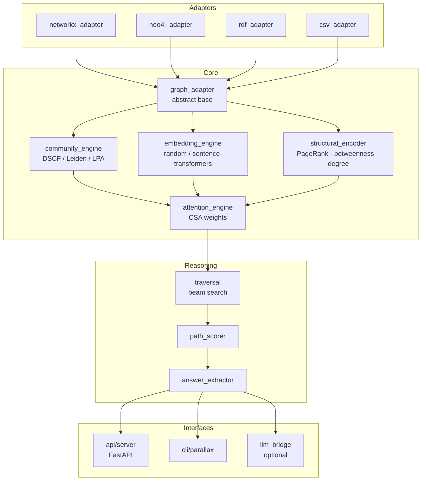
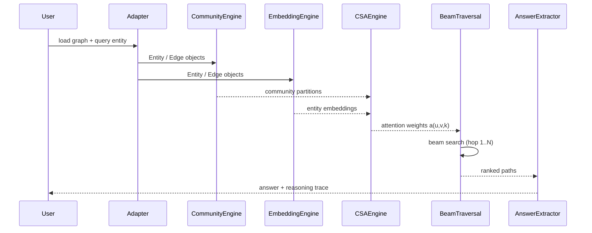
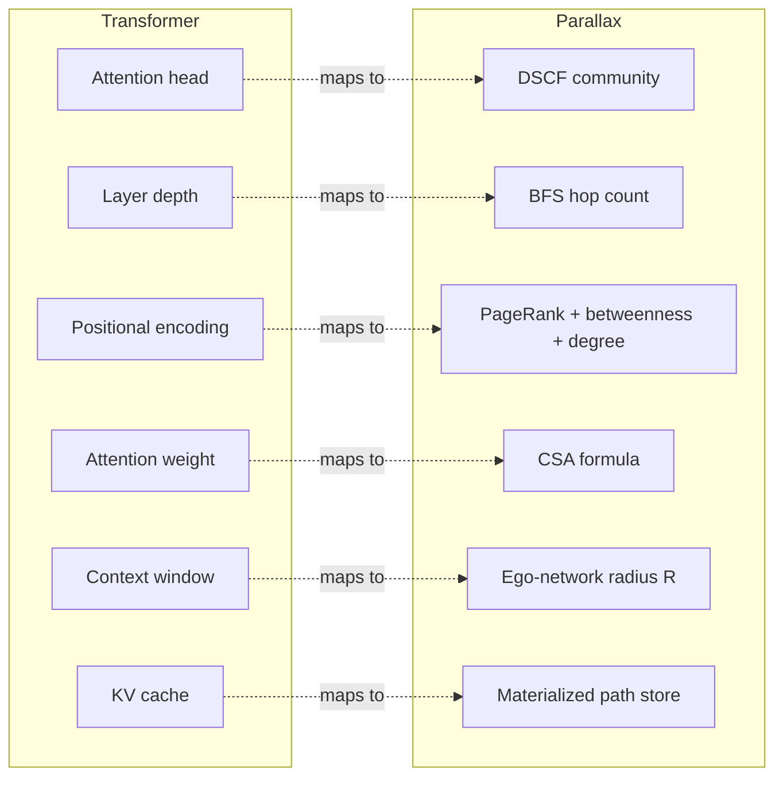

# Parallax

**Community-Structured Graph Attention for Knowledge Graph Reasoning**

Parallax enables Knowledge Graphs to perform multi-hop reasoning using the structural
principles of Transformer attention — without an LLM, without training data, and with
full interpretability of every inference step.

- **DSCF**: Dual-Signal Community Fusion — novel community detection combining LPA (local)
  and modularity gain (global) simultaneously at each node update
- **CSA**: Community-Structured Attention — attention weights that incorporate community
  membership as a soft global constraint on graph traversal
- **Zero hallucination**: every answer is a path through verified graph edges

See `PAPER.md` for the full white paper and architecture specification.

## Status

**Phase 0 complete.** DSCF prototype validated. Core architecture specified.
Phase 1 (core engine) is the current milestone.

## Quick Start

```bash
pip install -e ".[embeddings]"
python examples/csv_quickstart.py
```

## Architecture

### Module Structure



### Inference Data Flow



### Transformer ↔ KG Analogy



## Mathematical Foundation

Parallax is built on two core mathematical innovations that bridge the gap between graph topology and transformer-style attention.

### 1. Community-Structured Attention (CSA)

The core attention mechanism defines the weight $a(u,v,k)$ for an edge from node $u$ to node $v$ at traversal hop $k$:

$$a(u,v,k) = \sigma\left( \alpha \cdot \cos(\vec{e}_u, \vec{e}_v) + \beta \cdot S_{com}(u,v) + \gamma \cdot w_{rel} - \delta \cdot d_{norm}(u,v) + \epsilon \cdot \phi(k) \right)$$

Where:
- $\cos(\vec{e}_u, \vec{e}_v)$: Semantic similarity between entity embeddings.
- $S_{com}(u,v)$: **Community Score** — 1.0 if in the same community, 0.5 if adjacent, or $e^{-\lambda d}$ based on community-graph distance.
- $w_{rel}$: Weight assigned to the specific relation type.
- $d_{norm}(u,v)$: Normalized shortest-path distance.
- $\phi(k)$: Hop-depth decay function (e.g., $1/(1+k)$).
- $\sigma$: Sigmoid activation function.

### 2. Dual-Signal Community Fusion (DSCF)

DSCF identifies the "attention heads" by fusing local and global structural signals during community detection. At each node update, the algorithm weighs two distinct signals:

- **Local Signal (LPA)**: Majority vote among immediate neighbors (topological cohesion).
- **Global Signal (Modularity)**: Maximization of modularity gain $\Delta Q$ (structural significance).

The decision to move a node $v$ to community $C$ is governed by a temperature-annealing schedule $\tau$:
$$P(\text{move}) = f(\text{LPA}_{conf} \cdot \tau, \text{Mod}_{conf} \cdot (2-\tau))$$

This ensures that communities act as specialized relational contexts, much like multi-head attention in a Transformer.

### 3. Path Scoring & Coherence

Final reasoning paths are ranked using a composite score that integrates attention, community coherence, and semantic alignment:

$$\text{score}(P) = \left( \prod_{k=1}^L a(u_k, v_k, k) \right) \cdot \text{coherence}_{com}(P) \cdot \cos(\vec{h}_{final}, \vec{q})$$

Where **Community Coherence** ensures conceptual stability during traversal:

$$\text{coherence}_{com}(P) = \frac{1.0 \cdot N_{\text{intra}} + 0.5 \cdot N_{\text{cross}}}{N_{\text{total}}}$$

This penalizes incoherent "conceptual leaps" while rewarding deep local reasoning within a specific conceptual domain (attention head).

## Authors

Bryan Alexander Buchorn (AMP) — Independent Researcher
Claude Sonnet 4.6 — Research Collaborator, Anthropic
