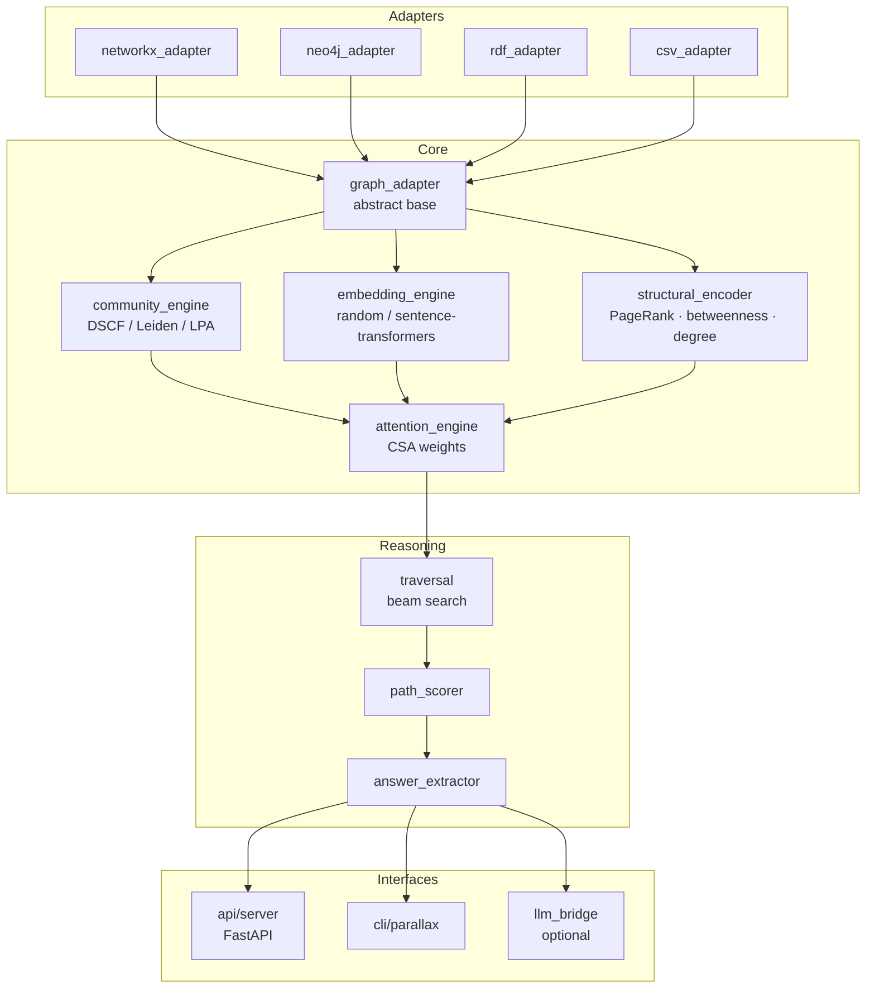
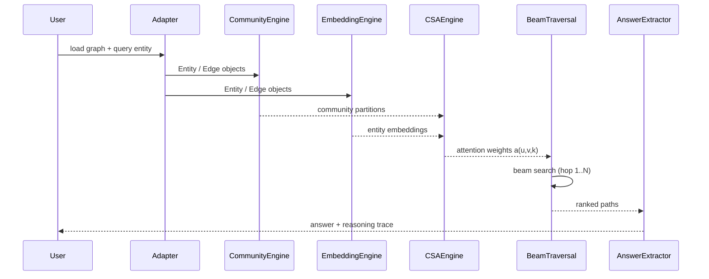
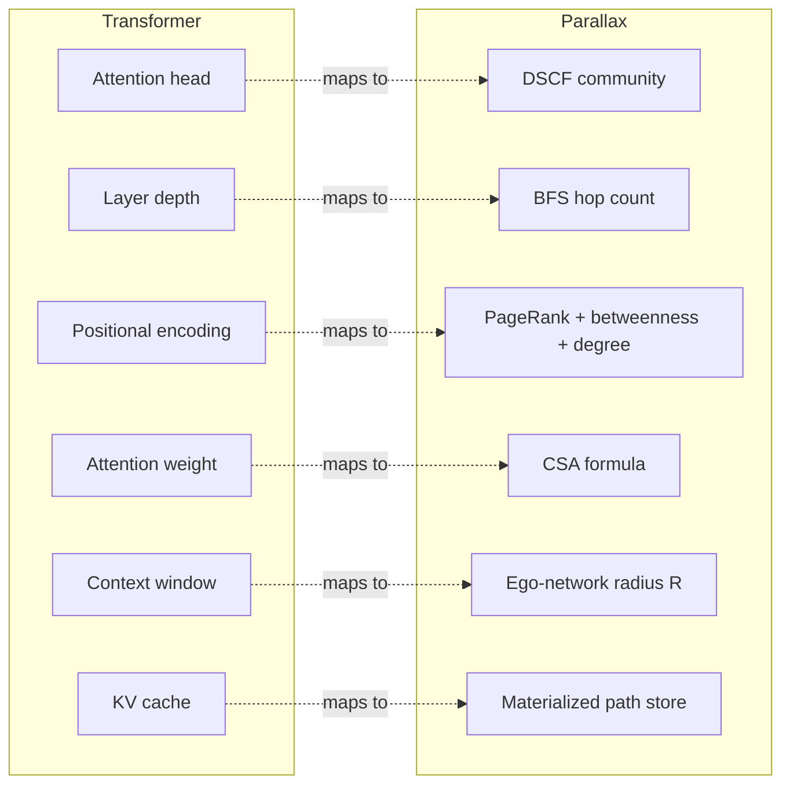

# Parallax

**Community-Structured Graph Attention for Knowledge Graph Reasoning**

Parallax enables Knowledge Graphs to perform multi-hop reasoning using the structural
principles of Transformer attention — without an LLM, without training data, and with
full interpretability of every inference step.

- **DSCF**: Dual-Signal Community Fusion — novel community detection combining LPA (local)
  and modularity gain (global) simultaneously at each node update
- **CSA**: Community-Structured Attention — attention weights that incorporate community
  membership as a soft global constraint on graph traversal
- **Zero hallucination**: every answer is a path through verified graph edges

See `PAPER.md` for the full white paper and architecture specification.

## Value Proposition

| Feature | Standard RAG | GraphRAG (Microsoft) | Parallax |
| :--- | :--- | :--- | :--- |
| **Primary Reasoner** | LLM | LLM | **Knowledge Graph** |
| **Logic Source** | Probabilistic weights | LLM-generated summaries | **Graph Topology (DSCF/CSA)** |
| **Hallucination Risk** | High | Medium | **Zero (Grounded Paths)** |
| **Interpretability** | None (Black-box) | Medium (Text chunks) | **Absolute (Verifiable Edges)** |
| **Context Window** | Limited by Token Count | Limited by Chunk Count | **Scale-Invariant (Beam Search)** |

## Roadmap

**Current Phase: 1 (Core Engine)**

- [x] **Phase 0: Theory & Prototyping** (DSCF validated in AURA)
- [ ] **Phase 1: Core Engine** (GraphAdapter, DSCF Engine, CSA Attention)
- [ ] **Phase 2: Reasoning Engine** (BeamTraversal, PathScorer)
- [ ] **Phase 3: Adapters & API** (Neo4j, RDF, FastAPI)
- [ ] **Phase 4: Benchmarking** (WebQSP, MetaQA-3hop)
- [ ] **Phase 5: Release** (v0.1.0 Stable)

## Quick Start

```bash
pip install -e ".[embeddings]"
python examples/csv_quickstart.py
```

## Genesis & Inspiration

Parallax was born from a simple engineering request during the development of **AURA** (an AI assistant platform): *"When I hit the clusters button, I want to see the clusters forming in real-time."* 

Achieving this required a deep dive into community detection. While exploring the trade-offs between **Leiden** (global modularity) and **Label Propagation** (local topology), a pivotal question was asked: *"Can we create an algorithm that includes structure from both simultaneously?"* This led to the creation of **DSCF**, which produces communities with the dual-signal character necessary for complex reasoning.

The conceptual leap occurred when we asked: *"How can we treat Knowledge Graphs like LLMs? Can the structure of an LLM be adapted to the data?"* By mapping Transformer components (Attention Heads, Layer Depth, Positional Encoding) to functional equivalents in Graph Theory (Communities, Hop Depth, Structural Metrics), we realized that a Knowledge Graph doesn't just store data—it can **reason** through structured attention.

## Architecture

### Module Structure



### Inference Data Flow



### Transformer ↔ KG Analogy



### Example: Reasoning Trace

Query: *"Who discovered a radioactive element?"*

1. **Entity Grounding**: `Marie Curie` is identified as the seed node.
2. **Hop 1 (Attention)**: `Marie Curie` $\xrightarrow{\text{discovered}}$ `Polonium`.
   - *CSA Weight*: High due to same community membership (Scientific Discoveries) and semantic alignment.
3. **Hop 2 (Traversal)**: `Polonium` $\xrightarrow{\text{is\_a}}$ `Radioactive Element`.
   - *CSA Weight*: High due to relation type weights and embedding proximity.
4. **Output**: The path `Marie Curie → discovered → Polonium → is_a → Radioactive Element` is returned as a grounded proof.

## Mathematical Foundation

Parallax is built on two core mathematical innovations that bridge the gap between graph topology and transformer-style attention.

### 1. Community-Structured Attention (CSA)

The core attention mechanism defines the weight $a(u,v,k)$ for an edge from node $u$ to node $v$ at traversal hop $k$:

$$a(u,v,k) = \sigma\left( \alpha \cdot \cos(\vec{e}_u, \vec{e}_v) + \beta \cdot S_{com}(u,v) + \gamma \cdot w_{rel} - \delta \cdot d_{norm}(u,v) + \epsilon \cdot \phi(k) \right)$$

Where:
- $\cos(\vec{e}_u, \vec{e}_v)$: Semantic similarity between entity embeddings.
- $S_{com}(u,v)$: **Community Score** — 1.0 if in the same community, 0.5 if adjacent, or $e^{-\lambda d}$ based on community-graph distance.
- $w_{rel}$: Weight assigned to the specific relation type.
- $d_{norm}(u,v)$: Normalized shortest-path distance.
- $\phi(k)$: Hop-depth decay function (e.g., $1/(1+k)$).
- $\sigma$: Sigmoid activation function.

### 2. Dual-Signal Community Fusion (DSCF)

DSCF identifies the "attention heads" by fusing local and global structural signals during community detection. At each node update, the algorithm weighs two distinct signals:

- **Local Signal (LPA)**: Majority vote among immediate neighbors (topological cohesion).
- **Global Signal (Modularity)**: Maximization of modularity gain $\Delta Q$ (structural significance).

The decision to move a node $v$ to community $C$ is governed by a temperature-annealing schedule $\tau$:
$$P(\text{move}) = f(\text{LPA}_{conf} \cdot \tau, \text{Mod}_{conf} \cdot (2-\tau))$$

This ensures that communities act as specialized relational contexts, much like multi-head attention in a Transformer.

### 3. Path Scoring & Coherence

Final reasoning paths are ranked using a composite score that integrates attention, community coherence, and semantic alignment:

$$\text{score}(P) = \left( \prod_{k=1}^L a(u_k, v_k, k) \right) \cdot \text{coherence}_{com}(P) \cdot \cos(\vec{h}_{final}, \vec{q})$$

Where **Community Coherence** ensures conceptual stability during traversal:

$$\text{coherence}_{com}(P) = \frac{1.0 \cdot N_{\text{intra}} + 0.5 \cdot N_{\text{cross}}}{N_{\text{total}}}$$

This penalizes incoherent "conceptual leaps" while rewarding deep local reasoning within a specific conceptual domain (attention head).

## Strategic Implications

Parallax introduces a fundamental shift in how Knowledge Graphs and Large Language Models interact, moving from passive retrieval to **active structural reasoning**.

- **Glass-Box Reasoning**: Shifts the AI paradigm from "black-box" probabilistic weights to "glass-box" deterministic graph paths. Every conclusion is auditable and grounded in explicit edges.
- **Decoupled Logic**: Separates *reasoning* (performed by the graph) from *language generation* (performed by the LLM), enabling high-accuracy inference without the need for trillion-parameter models.
- **Context Window Invariance**: Traversal complexity is governed by beam width and hop depth ($O(B \cdot L \cdot \bar{k} \cdot d)$), not graph size. This allows for reasoning over billion-node datasets that would otherwise shatter an LLM's context window.
- **Topological Intelligence**: Assumes that the "intelligence" of a system lies in the *topology* of its knowledge. By deriving attention heads from the graph's own shape via DSCF, Parallax employs a powerful inductive bias that requires zero training data.

## Authors

Bryan Alexander Buchorn (AMP) — Independent Researcher
Claude Sonnet 4.6 — Research Collaborator, Anthropic
