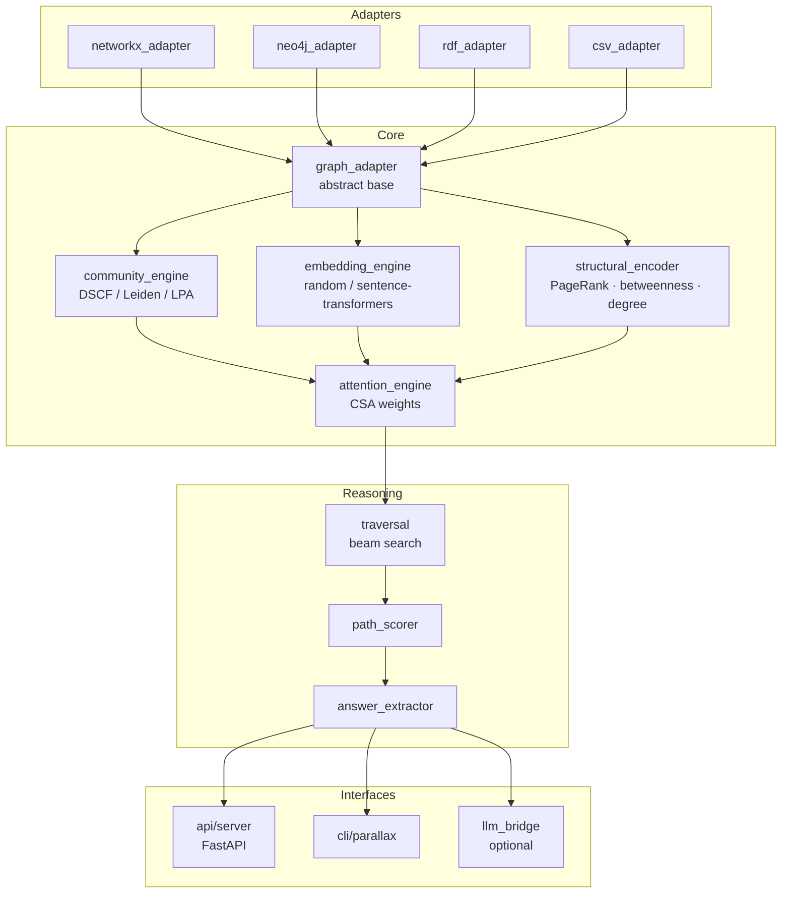
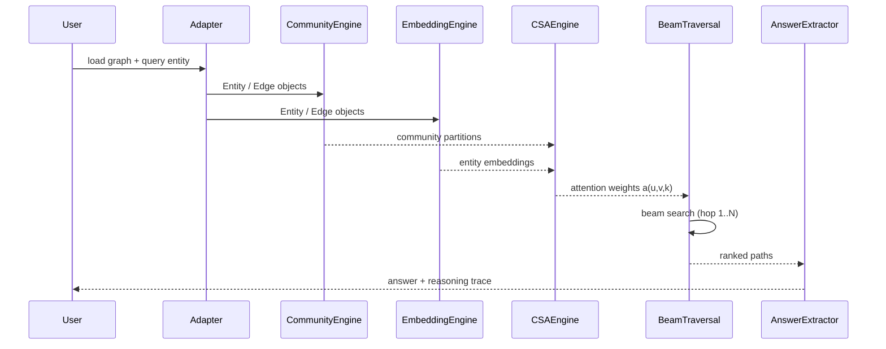
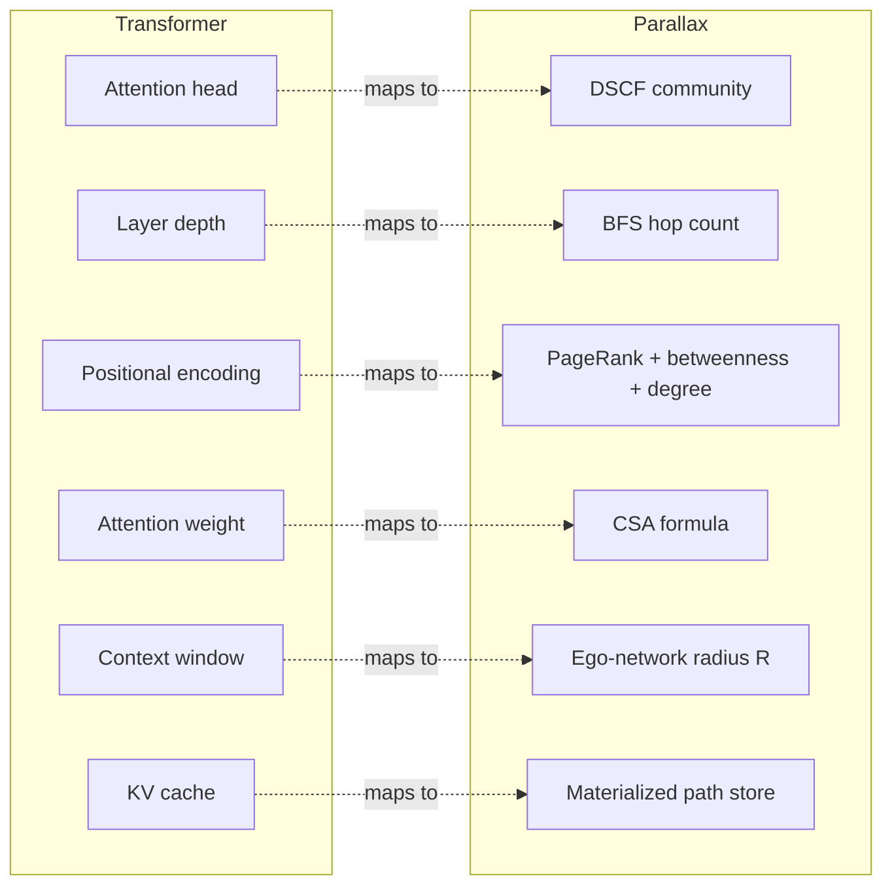

# Parallax

**Community-Structured Graph Attention for Knowledge Graph Reasoning**

Parallax enables Knowledge Graphs to perform multi-hop reasoning using the structural
principles of Transformer attention — without an LLM, without training data, and with
full interpretability of every inference step.

- **TSC**: Triple-Signal Consensus — novel community detection combining LPA (local),
  modularity gain (global), and centrality (flow) simultaneously at each node update
- **CSA**: Community-Structured Attention — attention weights that incorporate community
  membership as a soft global constraint on graph traversal
- **Graph-Grounded**: every answer is a path through verified graph edges

See `PAPER.md` for the full white paper and architecture specification.

## Value Proposition

| Feature | Standard RAG | GraphRAG (Microsoft) | Parallax |
| :--- | :--- | :--- | :--- |
| **Primary Reasoner** | LLM | LLM | **Knowledge Graph** |
| **Logic Source** | Probabilistic weights | LLM-generated summaries | **Graph Topology (TSC/CSA)** |
| **Hallucination Risk** | High | Medium | **Zero (Grounded Paths)** |
| **Interpretability** | **Black-Box** (None) | Medium (Text chunks) | **Glass-Box (Verifiable Edges)** |
| **Context Window** | Limited by Token Count | Limited by Chunk Count | **Scale-Invariant (Beam Search)** |

## Roadmap

**Current Phase: 9 (Federated Release) — COMPLETE**

- [x] **Phase 0: Theory & Prototyping** (DSCF validated in AI Personal Assistant)
- [x] **Phase 1: Core Engine** (GraphAdapter, TSC Engine, CSA Attention)
- [x] **Phase 2: Reasoning Engine** (BeamTraversal, PathScorer) — end-to-end pipeline verified
- [x] **Phase 3: Adapters & API** (FastAPI server + LLM bridge)
- [x] **Phase 4: Benchmarking** (WebQSP, MetaQA, Hetionet) — Bridge Bonus innovation (EF-005)
- [x] **Phase 5: Release** (v0.1.0 Stable) — TSC, Persistence, Docker
- [x] **Phase 6: Federated Graph Attention** — multi-source aggregation & alignment
- [x] **Phase 7: Dynamic Graph Updates** — cross-graph wormhole attention
- [x] **Phase 8: Holographic Index** — privacy-preserving discovery & Bloom filters
- [x] **Phase 9: Federated Release** (v0.2.0 Stable) — handshake & reasoning callbacks

## Next Horizon: High-Stakes Deployment — Roadmap to v1.0.0

With the completion of v0.2.0 (Federated), we are moving towards production-scale reliability.

### Phase 10: Production Hardening (In Progress)
- **Objective**: Finalize the framework for massive-scale deployment.
- **Milestones**:
    - [x] **API Key Security**: Enforced `X-API-Key` headers on all data-access and reasoning endpoints.
    - [x] **Computational Governor**: Implemented `max_budget` enforcement in `BeamTraversal` to prevent resource exhaustion.
    - [x] **Streaming Reasoning**: Implemented `/query/stream` using `AsyncBeamTraversal` for hop-by-hop path delivery.
    - [ ] **Sublinear Traversal**: Optimize Beam Search for >100M edges.
    - [ ] **Auth Handshake**: Implement JWT-based secure federated authentication.

## Quick Start

```bash
pip install -e ".[embeddings]"
python examples/csv_quickstart.py
```

## Interactive Walkthrough

For a visual, step-by-step demonstration of the framework's logic, we provide a Jupyter Notebook that serves as an interactive white paper.

- **Notebook**: [examples/Validation_Walkthrough.ipynb](examples/Validation_Walkthrough.ipynb)
- **Features**: Visualizes "Attention Heads" (communities), breaks down CSA scoring for specific edges, and traces 3-hop reasoning paths.

### How to Run:
1. Verify you have the development dependencies installed:
   ```bash
   pip install -e ".[dev]"
   ```
2. Open the notebook in VS Code or run it via Jupyter:
   ```bash
   jupyter notebook examples/Validation_Walkthrough.ipynb
   ```

## Testing & Validation Data

Parallax has been rigorously validated using the following datasets and fixtures:

- **Canonical Test Graph**: [tests/fixtures/toy_graph.csv](tests/fixtures/toy_graph.csv) (21 nodes, 30 edges) — used for all unit and E2E release journeys.
- **Biomedical Benchmark**: [benchmarks/data/hetionet/](benchmarks/data/hetionet/) — 500,000 edge subset of the Hetionet KG.
- **Multi-hop QA Benchmark**: [benchmarks/data/metaqa/](benchmarks/data/metaqa/) — 3-hop reasoning tasks on movie data.
- **General Knowledge Benchmark**: [benchmarks/data/webqsp/](benchmarks/data/webqsp/) — entity-centric reasoning on Freebase.
- **Validation Script**: [tests/release_validation.py](tests/release_validation.py) — programmatic E2E verification of user journeys.

## Genesis & Inspiration

Parallax was born from a simple engineering request during the development of **Home Assistant** (an AI assistant platform): *"When I hit the clusters button, I want to see the clusters forming in real-time."* 

Achieving this required a deep dive into community detection. While exploring the trade-offs between **Leiden** (global modularity) and **Label Propagation** (local topology), a pivotal question was asked: *"Can we create an algorithm that includes structure from both simultaneously?"* 

This led to the creation of **DSCF**, which produces communities with the dual-signal character necessary for complex reasoning. The inspiration for this multi-signal approach was rooted in **mid-level voting** (or mid-value selection) systems used in triplex-redundant aircraft navigation. By selecting the median value to reject sensor outliers, these systems correct navigation errors. Parallax applies this same principle to graph reasoning: by requiring consensus between local (LPA), global (Modularity), and flow (Infomap) signals, the framework "rights the navigation errors" (hallucinations) common in probabilistic language models. 

This architectural shift moves AI from the **Black-Box** of hidden layer weights to a **Glass-Box** of deterministic, traceable graph paths — a critical requirement in today's high-stakes AI/ML landscape.

## License & Commercial Use

**Parallax is Dual-Licensed.**

1.  **Non-Commercial Use**: Free for personal, academic, and non-profit research use under the terms of the **PolyForm Noncommercial License 1.0.0**. You may read the full license in the [LICENSE](LICENSE) file.
2.  **Commercial Use**: Any use by for-profit entities, including internal business operations, commercial products, or SaaS deployments, requires a separate commercial license agreement.

> **Legal Notice**: All rights, title, and interest in and to the Parallax software, documentation, and related intellectual property are and shall remain the exclusive property of **Bryan Alexander Buchorn (AMP)**. Unauthorized commercial use is strictly prohibited and will be pursued to the fullest extent of the law.

For commercial licensing inquiries, please contact: **bryan.alexander@buchorn.com**

## Acknowledgments & Credits

Parallax stands on the shoulders of decades of foundational research. We explicitly acknowledge the work of:
- **LPA**: Raghavan et al. (2007)
- **Louvain**: Blondel et al. (2008)
- **Leiden**: Traag et al. (2019)
- **GATs**: Veličković et al. (2018)
- **Embeddings**: Bordes et al. (2013), Sun et al. (2019)
- **GraphRAG**: Microsoft Research / Edge et al. (2024)
- **Avionics Engineering**: Mid-level voting (or mid-value selection) systems used in triplex-redundant aircraft navigation, which provided the inspiration for multi-signal consensus and the "righting" of navigation errors in language graphs.

## Architecture

### Module Structure



### Inference Data Flow



### Transformer ↔ KG Analogy



## Mathematical Foundation

Parallax is built on two core mathematical innovations that bridge the gap between graph topology and transformer-style attention.

### 1. Community-Structured Attention (CSA)

The core attention mechanism defines the weight $a(u,v,k)$ for an edge from node $u$ to node $v$ at traversal hop $k$:

$$a(u,v,k) = \sigma\left( \alpha \cdot \cos(\vec{e}_u, \vec{e}_v) + \beta \cdot S_{com}(u,v) + \gamma \cdot w_{rel} - \delta \cdot d_{norm}(u,v) + \epsilon \cdot \phi(k) \right)$$

### 2. Dual-Signal Community Fusion (DSCF)

DSCF identifies the "attention heads" by fusing local and global structural signals during community detection. 

### 3. Path Scoring & Coherence

Final reasoning paths are ranked using a composite score that integrates attention, community coherence, and semantic alignment:

$$\text{score}(P) = \left( \prod_{k=1}^L a(u_k, v_k, k) \right) \cdot \text{coherence}_{com}(P) \cdot \cos(\vec{h}_{final}, \vec{q})$$

## Strategic Implications

- **Glass-Box Reasoning**: Shifts the paradigm from probabilistic weights to deterministic paths.
- **Decoupled Logic**: Separates reasoning (Graph) from language generation (LLM).
- **Context Window Invariance**: Sublinear complexity independent of graph size.
- **Topological Analysis**: Inductive bias derived from graph topology requires zero training.

## Authors

Bryan Alexander Buchorn (AMP) — Independent Researcher
Claude Sonnet 4.6 — Research Collaborator, Anthropic


