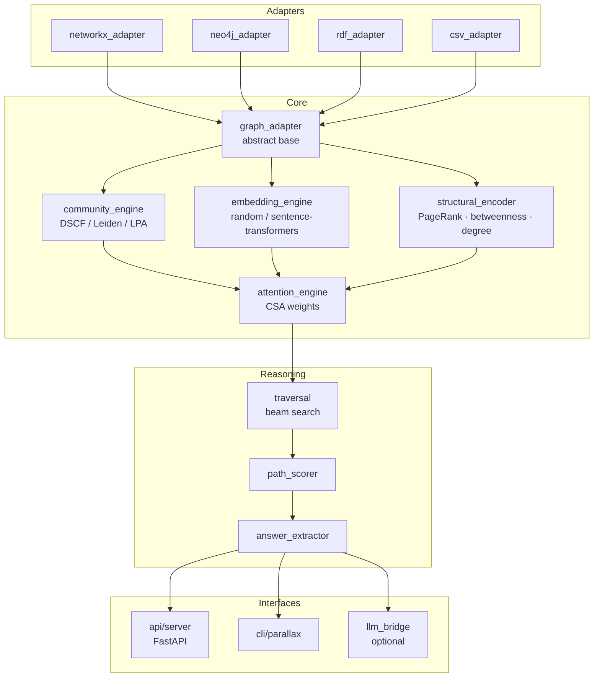
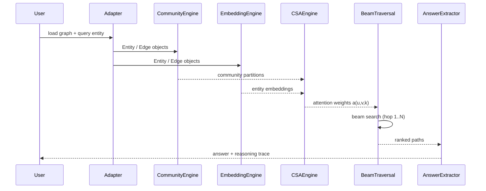
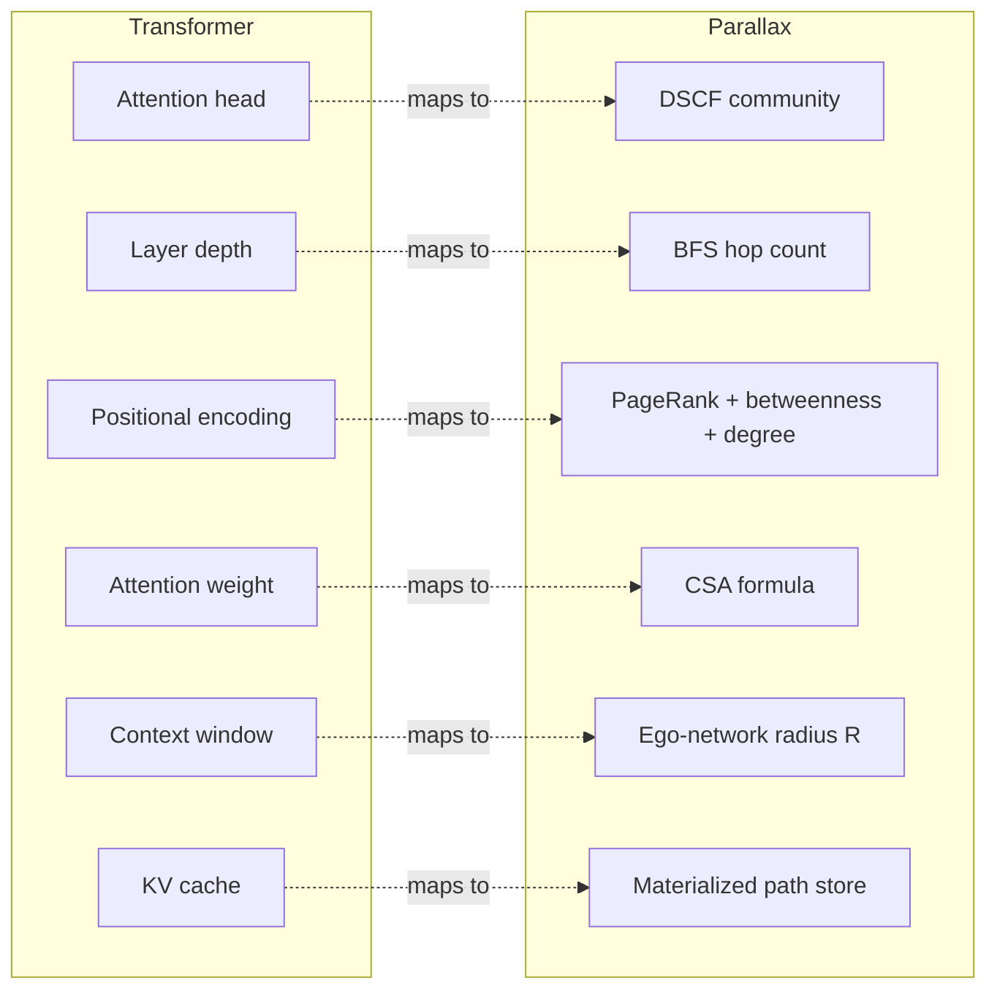

# Parallax

**Community-Structured Graph Attention for Knowledge Graph Reasoning**

Parallax enables Knowledge Graphs to perform multi-hop reasoning using the structural
principles of Transformer attention — without an LLM, without training data, and with
full interpretability of every inference step.

- **DSCF**: Dual-Signal Community Fusion — novel community detection combining LPA (local)
  and modularity gain (global) simultaneously at each node update
- **CSA**: Community-Structured Attention — attention weights that incorporate community
  membership as a soft global constraint on graph traversal
- **Zero hallucination**: every answer is a path through verified graph edges

See `PAPER.md` for the full white paper and architecture specification.

## Status

**Phase 0 complete.** DSCF prototype validated. Core architecture specified.
Phase 1 (core engine) is the current milestone.

## Quick Start

```bash
pip install -e ".[embeddings]"
python examples/csv_quickstart.py
```

## Architecture

### Module Structure



### Inference Data Flow



### Transformer ↔ KG Analogy



## Key Formula

```
a(u,v,k) = sigmoid(
    0.4 * cosine_sim(emb(u), emb(v))     # semantic similarity
  + 0.4 * community_score(u, v)           # structural membership
  + 0.1 * edge_type_weight                # relation type
  - 0.05 * normalized_distance            # path length penalty
  + 0.05 * hop_decay(k)                   # depth discount
)
```

## Authors

Bryan Alexander Buchorn (AMP) — Independent Researcher
Claude Sonnet 4.6 — Research Collaborator, Anthropic
