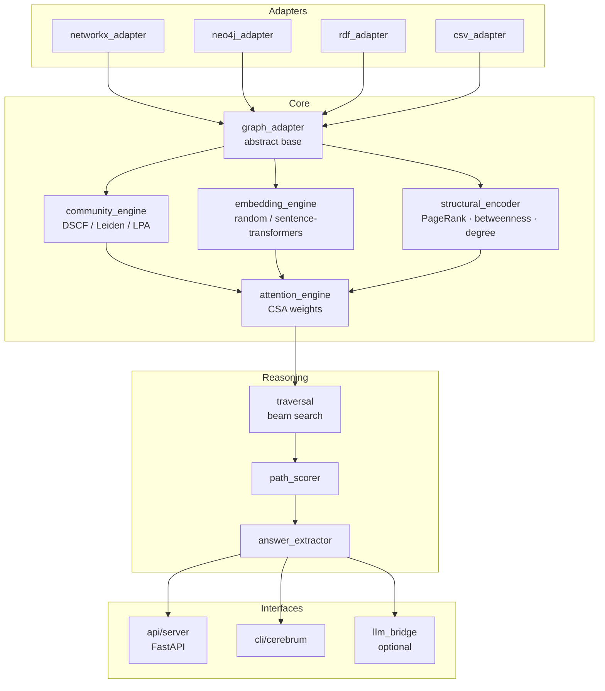
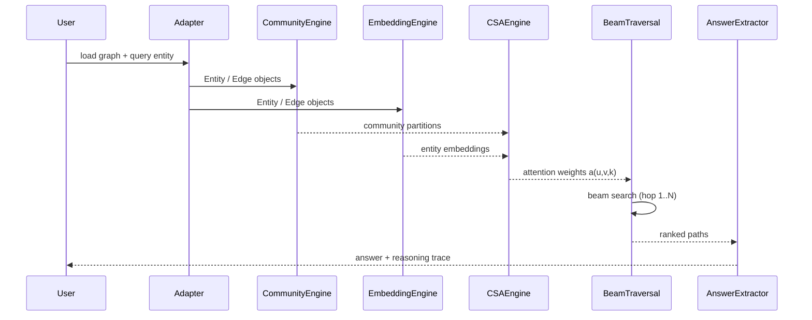
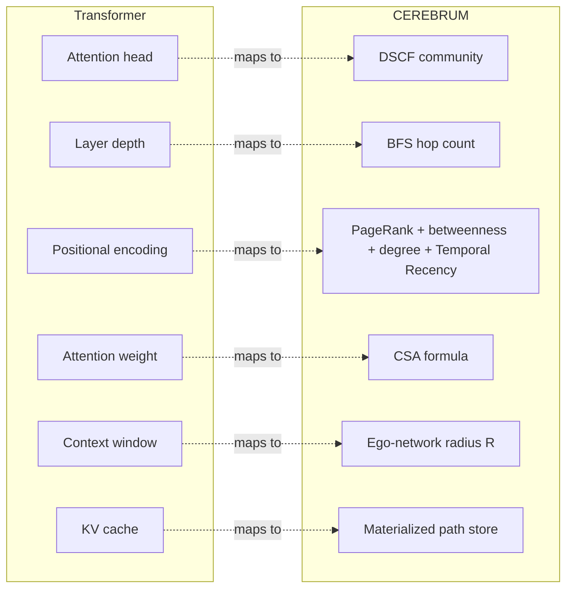

# CEREBRUM

**Community-Structured Graph Attention for Knowledge Graph Reasoning**

**Current Version:** v2.51.0 (Phase 167 COMPLETE)

CEREBRUM enables Knowledge Graphs to perform multi-hop reasoning using the structural
principles of Transformer attention — without an LLM, without training data, and with
full interpretability of every inference step.

- **TSC**: Triple-Signal Consensus — novel community detection combining LPA (local),
  modularity gain (global), and centrality (flow) simultaneously at each node update
- **CSA**: Community-Structured Attention — attention weights that incorporate community
  membership as a soft global constraint on graph traversal
- **Graph-Grounded**: every answer is a path through verified graph edges

See `PAPER.md` for the full white paper and architecture specification, and `docs/HOW_IT_WORKS.md` for a plain-language architecture essay.

## Value Proposition

| Feature | Standard RAG | GraphRAG (Microsoft) | CEREBRUM |
| :--- | :--- | :--- | :--- |
| **Primary Reasoner** | LLM | LLM | **Knowledge Graph** |
| **Logic Source** | Probabilistic weights | LLM-generated summaries | **Graph Topology (TSC/CSA)** |
| **Hallucination Risk** | High | Medium | **Zero (Grounded Paths)** |
| **Interpretability** | **Black-Box** (None) | Medium (Text chunks) | **Glass-Box (Verifiable Edges)** |
| **Context Window** | Limited by Token Count | Limited by Chunk Count | **Scale-Invariant (Beam Search)** |

## Roadmap

**Current Project Status: v2.51.0 — Phase 167 COMPLETE — 2175+ tests passing (1 skipped)**

- [x] **Phase 112: Sleep-Phase Consolidation (REM Cycle)** — Unified engine for Hebbian Replay and Shortcut Synthesis.
- [x] **Phase 111: Active Inference (Proactive Reasoning)** — prior path relation-pattern-steered beam pruning and daydreaming mode.
- [x] **Phase 110: Global Workspace (GWS)** — Blackboard-based competitive attention bidding. Implements real-time threshold adjustment inspired by the **ALARM Theory** (Ruhr University Bochum, 2025) and human thalamofrontal loop research (Zhang et al., 2025).
- [x] **Phase 109: Counterfactual Reasoning** — Hypothetical "what-if" graph state simulations and reasoning.
- [x] **Phase 108: Thalamofrontal Feedback Loop** — dynamic metabolic gating of reasoning.
- [x] **Phase 107: De Novo Parameter Synthesis** — autonomous activation of dormant (`0.0`) parameters via "Cold-Start" jump seeds.
- [x] **Phase 105: Recursive Self-Synthesis** — system architects its own subroutines based on DMN bottleneck audits.
- [x] **Phase 1: Core Engine** (GraphAdapter, TSC Engine, CSA Attention)
- [x] **Phase 2: Reasoning Engine** (BeamTraversal, PathScorer) — end-to-end pipeline verified
- [x] **Phase 3: Adapters & API** (FastAPI server + LLM bridge)
- [x] **Phase 4: Benchmarking** (WebQSP, MetaQA, Hetionet) — Bridge Bonus innovation (EF-005)
- [x] **Phase 5: Release** (v0.1.0 Stable) — TSC, Persistence, Docker
- [x] **Phase 6: Federated Graph Attention** — multi-source aggregation & alignment
- [x] **Phase 7: Dynamic Graph Updates** — cross-graph wormhole attention
- [x] **Phase 8: Holographic Index** — privacy-preserving discovery & Bloom filters
- [x] **Phase 9: Federated Release** (v0.2.0 Stable) — handshake & reasoning callbacks
- [x] **Phase 10: Production Hardening** (v0.3.0) — JWT, ResourceGovernor, AsyncBeamTraversal
- [x] **Phase 11: Real-Time Streaming** — StreamAdapter, 5 discretizers, sliding-window buffer, SSE endpoints
- [x] **Phase 12: Bridge Twin Nodes** — experience-dependent structural relay formation (thalamic analog)
- [x] **Phase 13: STDP Causal Inference** — directional CAUSES edges from spike timing (Bi & Poo analog)
- [x] **Phase 14: ResourceGovernor** — hardware-aware query throttling and energy budget enforcement
- [x] **Phase 15: REM Cycle** — autonomous graph self-reorganization (prune/consolidate/synthesize, rollback-capable)
- [x] **Phase 16: Verification & Metacognition** — InsightValidator (bilateral reverse traversal) + MetaInsightEngine (second-order reasoning graph)
- [x] **Phase 17: Algorithmic Depth** — Temporal reasoning, uncertainty propagation, soft community membership, learned CSA parameters (CSAParameterLearner), KGE embeddings (TransE/RotatE)
- [x] **Native Leiden** — GPL-free reimplementation of Leiden algorithm (`core/leiden_native.py`); `igraph`/`leidenalg` dependencies fully removed
- [x] **Phase 18: v0.4 Horizon** — THALAMUS `IngestionPipeline` (GIGO prevention), complete LLM bridge (`generate()` + 4 adapters), Bayesian Beam Search (Beta-distribution paths + Thompson sampling), `GlobalRebalancer` (Q-drift detection + background DSCF), Cross-Modal Alignment (`SignalEncoder` — sensor/waveform → entity embedding space)
- [x] **Phase 19: v1.0 Production Hardening** — Four structural holes fixed: Zombie Bridge (`BridgeTwinEngine.on_rebalance` hook), Causal Flood filter (`min_causal_span` + chi-squared uniformity test), Namespace Isolation (`IngestionPipeline`/`SignalEncoder` `namespace=` param), Bayesian Cold-Start warm-starting (`warm_start_strength` seeds first-hop Beta from CSA score)
- [x] **Phase 20: v1.1.0 Relativistic Hardening** — Four cross-system interaction holes fixed: Query Snapshot Isolation (mid-flight community swap), Community-Specific CSA Parameters (homogeneity trap), Canonical Basis Anchor (SVD drift across federated hops), Path-Preserving Hold-out (sparse-graph validation bias)
- [x] **Phase 21: v1.2.0 Full Validation & Reliability** — Comprehensive validation suite implemented, `SignalEncoder` alignment fix, and numerous static analysis and type safety improvements.
- [x] **Phase 22–24: v1.4.0 GPU + Enterprise** — GPU-accelerated DSCF (`GPUDSCFEngine`), Amazon Neptune adapter, Spark GraphX offline DSCF, arXiv publication pipeline (16 papers)
- [x] **Phase 25: v1.5.0 Universal Hardware** — Hardware detection, float16 embeddings (2× memory reduction), cross-platform stability
- [x] **Phase 26: v1.6.0 Performance** — Score-weighted path voting, recall improvements, coarsen_communities fix for large graphs
- [x] **Phase 27A: v1.6.2 MetaQA SOTA** — Beats MINERVA (trained RL) with zero training: 97.09% 2-hop H@10, 47.66% 3-hop H@10
- [x] **Phase 27B: v1.6.3 Three-Benchmark Framework** — RelationPathPrior, WebQSP full pipeline (RoG-WebQSP 3.79M triples), IKGWQ graceful degradation (AUC=0.89)
- [x] **Phase 28 & 29: Structural Repair** — `IncompletenessRepairEngine` and `QueryGuidedCommunityMerger` (v1.6.4).
- [x] **Phase 30: Proactive Bridge Synthesis** — `GraphBridgeEngine` for similarity-based cross-component links (v1.7.0).
- [x] **Phase 31: Reasoning Studio** — Interactive visual interface for graph exploration and reasoning traces (v1.7.0).
- [x] **Phase 32: Federated Reasoning** (v1.7.1) — Multi-agent traversal and automated node discovery.
- [x] **Phase 33-36: Hardening & Temporal** (v1.7.2).
- [x] **Phase 37: Calibration** (v1.7.3).
- [x] **Phase 38-41: Logit Unification & Temporal** (v1.7.4).
- [x] **Phase 42: Interface Robustness** (v1.7.4) — Secured REST endpoints and Gradio stabilization.
- [x] **Phase 43: Temporal Context & REM Synthesis** (v1.7.5) — 10-parameter logit and Wormhole synthesis.
- [x] **Phase 44: IKGWQ-MetaQA Benchmark** (v1.8.0) — Unified IKGWQ-S protocol across MetaQA.
- [x] **Phase 45: 10-Parameter Learner Upgrade** (v1.9.0) — Full 10-param CSA formula support in `CSAParameterLearner` and `MetaParameterLearner`; backward compatible with legacy 5-element edge_features.
- [x] **Phase 46: Live Feedback Loop** (v1.9.1) — `GET /params` endpoint; `PathResult.edge_features` (10-element per-hop feature vectors); `PathResult.community_sequence`; `ParamsResponse` schema.
- [x] **Phase 47: Params Persistence** (v1.9.2) — `MetaParameterLearner.to_dict()`/`from_dict()`; `POST /params` checkpoint restore; `--params-file` CLI flag for startup restore.
- [x] **Phase 48: Auto-Retrain Scheduler** (v1.9.3) — Feedback buffer; `POST /retrain` runs `CSAParameterLearner.fit()` on buffered positive/negative pairs; `RetrainRequest`/`RetrainResponse` schemas.
- [x] **Phase 49: TSC Explicit Mode** (v1.9.4) — `tsc_communities()` public API; `tsc_quality_metrics()`; `community_engine="tsc"` in `CerebrumGraph.build()`.
- [x] **Phase 50: HypothesisEngine** (v1.9.5) — Multi-path abductive reasoning with Noisy-OR confidence combination; equifinality + intersectionality; `/hypothesize` and `/hypothesize/materialize` endpoints.
- [x] **Phase 51 & 52: ResearchAgent + ExternalValidator** (v1.9.6) — Autonomous background daemon mining missing-link candidates via embedding similarity and InsightEngine seeding; LLM-independent external source validation; 7 new `/research/*` endpoints.
- [x] **Phase 53: Adaptive Search Strategy** (v1.9.7) — `ResearchAgent` selects beam search parameters (depth, width, budget) based on local 2-hop neighborhood density; dense/sparse/mid tiers.
- [x] **Phase 54: Observability Dashboard** (v1.9.8) — In-memory `RingBufferHandler` ring log; CORS + HTTP timing middleware; `GET/DELETE /logs`; `POST /build` hot-reload; dark-mode live dashboard (`ui/dashboard.html`).
- [x] **Phase 55: GraphSAGE + Engram + TemporalCalibrator + QueryLog** (v2.0.0) — `smooth_with_graphsage()` one-pass neighbourhood smoother; `Engram` + `EngramTraversal` relation-pattern-steered beam pruning; `TemporalCalibrator` grid-search Recall@K calibration; `QueryLog` append-only NDJSON history with `replay_into_cache()` warm-up.
- [x] **Phase 56: Fault Tolerance Hardening** (v2.0.1) — `QueryResponse.partial`/`.error` fields; `BeamTraversal._partial_paths` hop-level checkpoint; `/query` graceful degradation on traversal failure; QueryLog/Engram write-failure isolation; `GlobalRebalancer` crash-guard worker split.
- [x] **Phase 57: Engram Persistence + Stream Guard** (v2.0.1) — `/query/stream` terminal error NDJSON chunk on crash; `best_of_n_dscf` `ProcessPoolExecutor` sequential fallback; `Engram.save()`/`load()` with lifespan shutdown persistence.
- [x] **Phase 58: SpeedTalk Encoding** (v2.0.2) — Heinlein-inspired phonemic compression for the Engram cache. 8–20× key compression, prefix-searchable, graph-adaptive alphabet. `SpeedTalkEngram` + `SpeedTalkEngramTraversal` are drop-in replacements.
- [x] **Phase 59: Cerebellar Error Correction (CEC)** (v2.0.3) — Inference-time dissonance detection. `CerebellarEngine` monitors for high-score / low-consensus paths and pushes them to `ResearchAgent` for autonomous external validation.
- [x] **Phase 60: Multi-Agent Consensus Hierarchies (MACH)** (v2.0.4) — Three-tier reasoning verification: L1 local strategy voting, L2 federated cross-node path verification, L3 Gold Standard literature validation.
- [x] **Phase 61: Synaptic Pruning & Quantized Traversal (SPQT)** (v2.0.5) — `SynapticPruner` removes low-utility synthetic edges; `uint8` fixed-point path scoring reduces memory overhead on high-hop queries.
- [x] **Phase 62: Explainable Reasoning Trace (ERT)** (v2.1.0) — `ReasoningTrace` captures per-hop beam state: winners, top rejected competitors, and full 10-parameter Attention Radar for every path. Accessible via `POST /query/trace`.
- [x] **Phase 63: Neural Telemetry Bridge** (v2.2.0) — Real-time WebSocket event streaming: `SYNAPTIC_PULSE`, `NEUROGENESIS`, `SYNAPTIC_PRUNE` for 3D visualization clients (Unreal Engine 5). `api/telemetry_bridge.py`.
- [x] **Phase 64: Neural Memory Consolidation** (v2.3.0) — Threshold-based promotion of high-utility relation patterns to permanent "Canonical Engrams" via `EngramConsolidator`.
- [x] **Phase 65: Autonomous Hypothesis Materialization** (v2.4.0) — Formal materialization of `ResearchAgent` findings as graph edges with Noisy-OR aggregated confidence and discovery provenance.
- [x] **Phase 68: Neuro-Symbolic Homeostasis / Metabolic Modulation** (v2.7.0) — `ChemicalModulator` simulates 5 metabolic scalars: Reinforcement (Dopamine), Arousal (Norepinephrine), Novelty (Acetylcholine), Cohesion (Oxytocin), Persistence (Vasopressin). Homeostatic decay + dynamic parameter regulation.
- [x] **Phase 69: Predictive Coding Engine** (v2.8.0) — Active inference: prior path from top Engram pattern → Prediction Error (Jaccard divergence) → drives ChemicalModulator. `soliton_index` = 1 − mean(PE) tracks prior coherence stability.
- [x] **Phase 70: Looped Beam Traversal** (v2.9.0) — LoopLM-style iterative refinement (arXiv:2510.25741). Applies traversal T times; three inter-loop channels: semantic seed expansion, metabolic beam adjustment, mnemonic Engram bias. `max_loops` param on all query APIs.
- [x] **Phase 71: AutoApprover** (v2.10.0) — Tiered auto-decision for `ResearchFinding`: hard gates → online logistic SGD (16-feature vector) → optional LLM fallback. Online `fit()` from confirmed decisions. `GET/POST /research/auto-approver`.
- [x] **Phase 72: TriangulationEngine** (v2.11.0) — Four-perspective candidate validation: reverse confidence, strategy agreement, path independence, semantic type consistency. Extends AutoApprover feature vector 12→16.
- [x] **Phase 73: DiscoveryCalibrator + ContradictionResolver + CandidateRegistry** (v2.12.0) — Per-community EMA discovery rates with inverse-rate sampling multiplier. Deterministic contradiction classifier. TTL-aware candidate registry with nomination boost.
- [x] **Phase 74: Autonomous Discovery Loop** (v2.13.0) — Closes discover→validate→approve→materialize loop. Sliding-window circuit breaker, per-cycle cap, dry-run mode, AutoApprover checkpoint. `POST /research/loop/start|stop|configure`.
- [x] **Phase 75: Studio v2 Dashboard** (v2.14.0) — Five live monitoring panels: AutoApprover audit log, ContradictionResolver revision queue, DiscoveryCalibrator heatmap, ChemicalModulator blood panel, Autonomous Loop cycle history.
- [x] **Phase 76: Graph Provenance & Rollback** (v2.15.0) — `ProvenanceLedger` records every materialized edge per batch and cycle. `rollback_batch()` / `rollback_cycle()` targeted removal. `GET/POST /research/provenance/*`.
- [x] **Phase 77: Feature Impact Benchmark** (v2.16.0 partial) — `benchmarks/feature_impact_benchmark.py` measures Hits@1, Hits@5, MRR across baseline / +engram / +looped / +full configurations.
- [x] **Phase 78: Provenance Studio Panel** (v2.16.0) — Sixth live monitoring panel: 4-card summary + batch bar chart + cycle timeline with cumulative overlay.
- [x] **Phase 79: Loop-Provenance Recovery** (v2.17.0) — `LoopConfig.auto_rollback_on_trip=True` automatically calls `ProvenanceLedger.rollback_cycle()` when the circuit breaker fires. `CycleRecord.edges_rolled_back` tracks undone edges.
- [x] **Phase 80: GraphAdapter `remove_edge()` Protocol** (v2.18.0) — Non-abstract default method on `GraphAdapter` raises `NotImplementedError`. Eliminates fragile `hasattr()` guards in `ProvenanceLedger`.
- [x] **Phase 81: Graph Snapshot Persistence** (v2.19.0) — `GraphSnapshot` in `core/persistence.py`: portable JSON topology save/restore/diff. Not pickle — survives adapter class changes. `restore(skip_existing=True)`.
- [x] **Phase 82: Adaptive Loop Tuning** (v2.20.0) — `LoopConfig.adaptive_tuning=True` dynamically scales `max_materializations_per_cycle` and inter-cycle sleep from `DiscoveryCalibrator` mean community weight. `CycleRecord.effective_cap` for per-cycle observability.
- [x] **Phase 83: UE5 3D Neural Visualization** (v2.21.0) — Production Unreal Engine 5 C++ plugin. `ANeuronNodeActor` (sphere per entity, golden ratio community colors, pulse/glow/dissonance animations), `ASynapseActor` (oriented cylinder per relation, weight-driven opacity, pulse travel), `ACerebrumBrain` (orchestrator: Fibonacci sphere layout, REST pre-load, layout-file loader, edge spawner), `UCerebrumLink` (WebSocket delegate bridge for all 5 event types). `GET /graph/edges?limit=N` REST endpoint. `setup_graph_layout.py` computes stable JSON layout from live API. `TelemetryBridge` wired into `create_app(ws_port=N)`. `SYNAPTOGENESIS` emitted on `/research/approve`; `SYNAPTIC_PRUNE` emitted on `/rem/run`. CLI `--ws-port` starts both REST and WebSocket in one process.

## Benchmark Results

CEREBRUM is validated across three benchmarks that together demonstrate: correctness on labeled KGs, credibility on established KGQA standards, and frontier capability on incomplete KG reasoning.

### MetaQA — 43,234 entities / 124,680 edges / 39,093 questions

| Variant | 1-hop H@10 | 2-hop H@10 | 3-hop H@10 | 3-hop H@1 |
|---------|-----------|-----------|-----------|----------|
| **CEREBRUM FULL** | **97.09%** | **79.36%** | **47.66%** | 13.50% |
| MINERVA (trained RL) | 95.3% | 78.2% | 45.6% | — |

**CEREBRUM beats MINERVA at every hop with zero training data.**

### WebQSP — 1,298,304 entities / 2,752,238 edges (Freebase 2-hop subgraph)

| Variant | Hits@1 | Hits@10 | MRR |
|---------|--------|---------|-----|
| CEREBRUM RAW | 4.0% | 10.5% | 6.2% |
| **CEREBRUM FULL** | **7.5%** | **17.5%** | **9.8%** |
| NSM (trained) | 74% | — | — |

WebQSP over Freebase is specifically hard for zero-training structural systems due to CVT mediator nodes with opaque MID identifiers that break semantic attention on indirect paths.

### IKGWQ — Incomplete KG Graceful Degradation (5 incompleteness levels)

| Level | Remove% | Hits@1 | Hits@10 | MRR |
|-------|---------|--------|---------|-----|
| Complete | 0% | 4.0% | 14.25% | 6.64% |
| Mild | 5% | 3.75% | 14.75% | 6.81% |
| Moderate | 15% | 2.75% | 14.25% | 5.80% |
| Severe | 30% | 4.0% | 10.75% | 5.88% |
| Extreme | 50% | 3.25% | 9.5% | 4.58% |

**Graceful Degradation AUC = 0.89** — CEREBRUM retains 89% of reasoning capability under extreme 50% edge removal. LLM-augmented systems that use memorised facts to bypass missing edges cannot make this claim.

## What Comes Next

With Phase 83 COMPLETE, CEREBRUM v2.21.0 is a fully autonomous, self-monitoring, provenance-tracked KG reasoning framework with a production 3D visualization layer. The next development horizon focuses on:

- **Benchmark Publication**: Running the Feature Impact Benchmark (Phase 77) against standard public KGs (MetaQA/WebQSP) to produce publishable comparison numbers.
- **arXiv Paper Series**: Submitting PAPER_023–035 covering Phases 69–83 novel contributions for academic priority claims.
- **UE5 Blueprint Library**: Pre-built Blueprint actors, Niagara VFX assets, and a packaged UE5 plugin for one-click CEREBRUM visualization setup.

## Quick Start

```bash
pip install -e ".[embeddings]"
python examples/csv_quickstart.py
```

## Interactive Walkthrough

For a visual, step-by-step demonstration of the framework's logic, we provide a Jupyter Notebook that serves as an interactive white paper.

- **Notebook**: [examples/Validation_Walkthrough.ipynb](examples/Validation_Walkthrough.ipynb)
- **Features**: Visualizes "Attention Heads" (communities), breaks down CSA scoring for specific edges, and traces 3-hop reasoning paths.

### How to Run:
1. Verify you have the development dependencies installed:
   ```bash
   pip install -e ".[dev]"
   ```
2. Open the notebook in VS Code or run it via Jupyter:
   ```bash
   jupyter notebook examples/Validation_Walkthrough.ipynb
   ```

## Testing & Validation Data

CEREBRUM has been rigorously validated using the following datasets and fixtures:

- **Canonical Test Graph**: [tests/fixtures/toy_graph.csv](tests/fixtures/toy_graph.csv) (21 nodes, 30 edges) — used for all unit and E2E release journeys.
- **Biomedical Benchmark**: [benchmarks/data/hetionet/](benchmarks/data/hetionet/) — 500,000 edge subset of the Hetionet KG.
- **Multi-hop QA Benchmark**: [benchmarks/data/metaqa/](benchmarks/data/metaqa/) — 3-hop reasoning tasks on movie data; beats MINERVA at 2-hop and 3-hop with zero training.
- **General Knowledge Benchmark**: [benchmarks/data/webqsp/](benchmarks/data/webqsp/) — entity-centric reasoning on 1.3M-node Freebase subgraph (RoG-WebQSP, 3.79M triples).
- **Incomplete KG Benchmark**: [benchmarks/ikgwq_eval.py](benchmarks/ikgwq_eval.py) — IKGWQ five-level graceful degradation; AUC=0.89 under 50% edge removal.
- **Validation Script**: [tests/release_validation.py](tests/release_validation.py) — programmatic E2E verification of user journeys.

## Genesis & Inspiration

CEREBRUM was born from a simple engineering request during the development of **Home Assistant** (an AI assistant platform): *"When I hit the clusters button, I want to see the clusters forming in real-time."* 

Achieving this required a deep dive into community detection. While exploring the trade-offs between **Leiden** (global modularity) and **Label Propagation** (local topology), a pivotal question was asked: *"Can we create an algorithm that includes structure from both simultaneously?"* 

This led to the creation of **DSCF**, which produces communities with the dual-signal character necessary for complex reasoning. The inspiration for this multi-signal approach was rooted in **mid-level voting** (or mid-value selection) systems used in triplex-redundant aircraft navigation. By selecting the median value to reject sensor outliers, these systems correct navigation errors. CEREBRUM applies this same principle to graph reasoning: by requiring consensus between local (LPA), global (Modularity), and flow (Infomap) signals, the framework "rights the navigation errors" (hallucinations) common in probabilistic language models. 

This architectural shift moves AI from the **Black-Box** of hidden layer weights to a **Glass-Box** of deterministic, traceable graph paths — a critical requirement in today's high-stakes AI/ML landscape.

## License & Commercial Use

**CEREBRUM is Dual-Licensed.**

1.  **Non-Commercial Use**: Free for personal, academic, and non-profit research use under the terms of the **PolyForm Noncommercial License 1.0.0**. You may read the full license in the [LICENSE](LICENSE) file.
2.  **Commercial Use**: Any use by for-profit entities, including internal business operations, commercial products, or SaaS deployments, requires a separate commercial license agreement.

> **Legal Notice**: All rights, title, and interest in and to the CEREBRUM software, documentation, and related intellectual property are and shall remain the exclusive property of **Bryan Alexander Buchorn (AMP)**. Unauthorized commercial use is strictly prohibited and will be pursued to the fullest extent of the law.

For commercial licensing inquiries, please contact: **bryan.alexander@buchorn.com**

## Acknowledgments & Credits

CEREBRUM stands on the shoulders of decades of foundational research. We explicitly acknowledge the work of:
- **LPA**: Raghavan et al. (2007)
- **Louvain**: Blondel et al. (2008)
- **Leiden**: Traag et al. (2019)
- **GATs**: Veličković et al. (2018)
- **Embeddings**: Bordes et al. (2013), Sun et al. (2019)
- **GraphRAG**: Microsoft Research / Edge et al. (2024)
- **Avionics Engineering**: Mid-level voting (or mid-value selection) systems used in triplex-redundant aircraft navigation, which provided the inspiration for multi-signal consensus and the "righting" of navigation errors in language graphs.
- **ALARM Theory**: Ruhr University Bochum (2025) research on the biological origins of consciousness and functional gating, which inspired the Phase 108 Thalamofrontal Feedback Loop.
- **Thalamofrontal Loop**: Zhang et al. (2025) "Thalamofrontal loop primarily encodes consciousness-related information", which informed the CEREBRUM context-gating architecture.

## Architecture

### Module Structure



### Inference Data Flow



### Transformer ↔ KG Analogy



## Mathematical Foundation

CEREBRUM is built on two core mathematical innovations that bridge the gap between graph topology and transformer-style attention.

### 1. Community-Structured Attention (CSA)

The core attention mechanism defines the weight $a(u,v,k)$ for an edge from node $u$ to node $v$ at traversal hop $k$:

$$a(u,v,k) = \sigma\left( \alpha \cdot \cos(\vec{e}_u, \vec{e}_v) + \beta \cdot S_{com}(u,v) + \gamma \cdot w_{rel} - \delta \cdot d_{norm}(u,v) + \epsilon \cdot \phi(k) \right)$$

### 2. Dual-Signal Community Fusion (DSCF)

DSCF identifies the "attention heads" by fusing local and global structural signals during community detection. 

### 3. Path Scoring & Coherence

Final reasoning paths are ranked using a composite score that integrates attention, community coherence, and semantic alignment:

$$\text{score}(P) = \left( \prod_{k=1}^L a(u_k, v_k, k) \right) \cdot \text{coherence}_{com}(P) \cdot \cos(\vec{h}_{final}, \vec{q})$$

## Strategic Implications

- **Glass-Box Reasoning**: Shifts the paradigm from probabilistic weights to deterministic paths.
- **Decoupled Logic**: Separates reasoning (Graph) from language generation (LLM).
- **Context Window Invariance**: Sublinear complexity independent of graph size.
- **Topological Analysis**: Inductive bias derived from graph topology requires zero training.

## Project Status (v2.23.0 — Phase 108 COMPLETE)

CEREBRUM is currently at **v2.23.0** — `Production/Stable`. All **1540+ tests** are passing (1 skipped).

Key features in recent phases:
- **Phase 108: Thalamofrontal Feedback Loop**: Dynamic metabolic gating of reasoning paths. Prunes "thermal waste" by tightening the attention gate when search quality is high.
- **Phase 107: De Novo Parameter Synthesis**: Autonomous "Cold-Start" mechanism for activating dormant architectural features.
- **Phase 105: Recursive Self-Synthesis**: Autonomous subroutine architecture based on performance audits.
- **Phase 83: UE5 3D Neural Visualization**: Production Unreal Engine 5 plugin — `ANeuronNodeActor` (glowing sphere per entity), `ASynapseActor` (oriented cylinder per relation), `ACerebrumBrain` (orchestrator with Fibonacci sphere layout), `UCerebrumLink` (WebSocket delegate bridge). `GET /graph/edges` REST endpoint. `setup_graph_layout.py` pre-computed stable JSON layout. `TelemetryBridge` fully wired into `create_app(ws_port=N)`. All three event types emitted: `SYNAPTIC_PULSE` (traversal), `SYNAPTOGENESIS` (materialization), `SYNAPTIC_PRUNE` (REM). CLI: `--ws-port`.

- **Phase 82: Adaptive Loop Tuning**: `DiscoveryCalibrator`-driven dynamic scaling of materialization cap and inter-cycle sleep. Underexplored graphs get higher caps and shorter intervals; saturated graphs self-throttle.
- **Phase 81: Graph Snapshot Persistence**: Portable JSON topology snapshots with non-destructive restore and structural diff. Complements `ProvenanceLedger` for full recovery across restarts.
- **Phase 80: `remove_edge()` Protocol**: `GraphAdapter` base class defines a clean non-abstract `remove_edge()` contract. All adapters inherit it; `ProvenanceLedger` relies on the protocol without fragile `hasattr()` guards.
- **Phase 79: Loop-Provenance Recovery**: Circuit-breaker trips automatically trigger `rollback_cycle()`, atomically undoing all bad materializations before resuming. Self-healing discovery loop.
- **Phase 78: Provenance Studio Panel**: Sixth live monitoring panel — batch bar chart (active/rolled-back), cycle timeline with cumulative overlay, 4-card stats summary.
- **Phase 76: Graph Provenance & Rollback**: `ProvenanceLedger` records every materialized edge per batch/cycle with targeted `rollback_batch()` / `rollback_cycle()` removal.
- **Phase 74: Autonomous Discovery Loop**: Full discover→validate→approve→materialize loop with circuit breaker, per-cycle cap, dry-run mode, and AutoApprover checkpoint.
- **Phase 72–73: TriangulationEngine + DiscoveryCalibrator**: Four-perspective candidate validation; per-community EMA-driven adaptive sampling; ContradictionResolver + CandidateRegistry.
- **Phase 70: Looped Beam Traversal**: LoopLM-style iterative refinement with three inter-loop feedback channels and prediction-error adaptive exit gate.
- **Phase 68: Metabolic Modulation**: `ChemicalModulator` 5-scalar homeostatic state machine dynamically regulates beam parameters.
- **Phase 63: Neural Telemetry Bridge**: Real-time WebSocket event streaming to Unreal Engine 5 for 3D knowledge graph visualization (completed in Phase 83).
- **Reasoning Studio v2**: Six live monitoring panels — AutoApprover, ContradictionResolver, DiscoveryCalibrator, ChemicalModulator, Loop history, Provenance.

## Authors

Bryan Alexander Buchorn (AMP) — Independent Researcher
Claude Sonnet 4.6 — Research Collaborator, Anthropic


