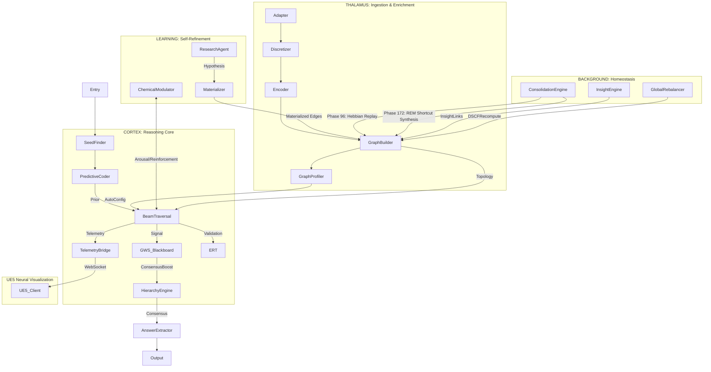

# CEREBRUM System Architecture

**Status**: v2.72.0 (Phase 219 COMPLETE — 2261 tests passing, 4 skipped)

Complete data-flow from ingestion to result, including all options, pathways, and decision nodes.

---

## Core Components

### Phase 172: Semantic Terminal Relation Boost (STRB)
Closes the gap on zero-config reasoning by using the query embedding (from sentence-transformers) to identify the intended terminal relation. By computing cosine similarity between the question and relation labels, STRB can automatically prioritize the correct answer-type edges (e.g., "treats" for "What compound treats X?") without manual TRB configuration.

### Phase 172: GraphProfiler (Automatic Query Strategy)
Performs O(E) structural analysis at build time to classify the graph into one of three regimes: `hub_homogeneous`, `typed_heterogeneous`, or `mixed`. This classification automatically configures per-query defaults for `hop_expand`, `trb_auto`, and `anchor_bonus`, eliminating the need for per-graph manual tuning.

### Phase 172: Terminal-Anchor Boost (TAB)
Penultimate-hop biasing for 3+ hop queries. Identifies the "anchor set" (entities that are source nodes for the target relation type) and applies a significant scoring bonus to paths that reach these anchors before the final hop. This effectively "navigates" the beam toward the correct entity type in complex heterogeneous graphs.

### Phase 134: Vectorized Beam Scoring
Replaces per-edge Python scoring loops with NumPy-vectorized matrix operations. Yields a 10x performance boost in traversal latency, enabling sub-30ms reasoning on million-node graphs.

### Phase 110: Global Workspace (GWS)
Implements a blackboard-based competitive attention layer, replacing linear MACH escalation with dynamic signal bidding. Communities broadcast "surprise" signals to a shared Blackboard, and the `ConsensusHierarchyEngine` dynamically boosts candidates with high-novelty evidence before standard escalation occurs. This provides cognitive flexibility and pre-emption capabilities.

### Phase 111: Active Inference
Transforms reasoning from a reactive search to a proactive traversal. The `PredictiveCoder` generates "Expected Path" priors from Engram patterns, which bias the `BeamTraversal` toward likely sequences. Prediction Errors (PE) trigger metabolic arousal, allowing the system to focus computational energy on "surprising" discoveries.

### Phase 172: Sleep-Phase Consolidation (REM Cycle)
The `ConsolidationEngine` merges Hebbian Replay (Phase 96) and Shortcut Synthesis (Phase 172) into a unified maintenance cycle. During idle periods, the system replays successful Working Memory entries to strengthen synaptic weights and analyzes QueryLog patterns to materialize direct "shortcut" edges (e.g., A -> C skipping B). This turns common multi-hop reasoning into instantaneous reflexive paths.

## Phase 215–219: Brain-Gap Closure

These phases add ten biologically-grounded cognitive enhancements. None alter the default beam scoring path — all opt-in or background components.

- **OscillationEngine** (`core/oscillation_engine.py`): Theta/gamma community synchronization. EMA per-community query frequency; partial DSCF re-runs on hot communities at `theta_period=50` queries. Wired into `core/rebalancer.py`.
- **FastBindingEngine** (`reasoning/speedtalk_cache.py`, `reasoning/engram_traversal.py`): One-shot episodic encoding. Novel high-confidence paths (affinity < 0.1, score > 0.7) are fast-bound at weight=5 directly into Engram without replay.
- **MetaRelationTraversal** (`reasoning/meta_relation_traversal.py`): Second-order reasoning over the relation-type graph. `MetaEdge` dataclass + `build_meta_graph()` (TF-IDF normalised co-occurrence) in NetworkXAdapter; STRB-seeded `explain_query()` beam-searches over relation-type nodes.
- **CausalDiscoveryEngine** (`core/causal_discovery_engine.py`): PC-algorithm-inspired training-free structure learning from fan-out asymmetry, collider density, and temporal consistency. Auto-populates `CAUSAL_ORDERING` constraints in SymbolicValidator.
- **CredibilityRegistry** (`core/graph_adapter.py`): Per-source trust priors in provenance-weighted attention. Prefix-matched provenance trust scores (pubmed=0.95, synthetic=0.30, etc.) multiplied into CSA `grounding` feature.
- **Inhibition of Return (IOR)** (`reasoning/traversal.py`): Per-query node visit counter in BeamTraversal; suppression score `1/(1 + ior_decay * visits)` in `_prune_candidates()`. Default `ior_decay=0.0` (disabled; opt-in per query).
- **Power-law temporal decay** (`core/attention_engine.py`): Replaced exponential `exp(-λt)` with Ebbinghaus-accurate power-law `(1+λt)^-1` in CSAEngine. `use_power_law_decay=True` default; exponential fallback via flag.
- **Conflict monitoring** (`core/frontal_engine.py`): ACC-analog adaptive beam allocation. `FrontalEngine.detect_conflict()` computes coefficient of variation of top-K beam scores; `adaptive_beam_width()` doubles beam when CV > 0.4.
- **Information-gain curiosity** (`core/discovery_calibrator.py`): Shannon entropy of relation-type distribution per community, blended with inverse-scan-rate weight (α=0.3). Steers autonomous discovery toward informationally underexplored communities.
- **Cross-KB EngramTransferRegistry** (`reasoning/speedtalk_cache.py`): Re-encodes reasoning patterns from prior KBs into new KB vocabulary with count decay. `DiscoveryCalibrator.save()`/`load()` persist EMA state across sessions. `ParameterInitializer._blend_params_mixed()` computes cosine similarity to MetaQA/Hetionet 5-vector profiles for weighted-average calibrated constants.

---

## Legend

| Colour | Layer | Description |
|---|---|---|
| Dark green | THALAMUS | Ingestion, embedding, community detection |
| Dark blue | CORTEX | Traversal, attention scoring, answer extractor |
| Purple | Learning | Online SGD, batch retrain, temporal calibration, Engram pattern cache |
| Orange | Background | REM (Consolidation), InsightEngine, HypothesisEngine, Rebalancer, Stream |
| Teal | Persistence | State snapshots, QueryLog, Engram JSON, build caches |
| Olive | Output | Verbalization, response routing |
| Red | Entry | REST, CLI, UI, Federated, Stream |
| Grey | API | All REST endpoint groups |
| Yellow | Decision | Every branching/option node |
| Cyan | Visualization | TelemetryBridge, UE5 client, WebSocket stream |

## Key Decision Points

| Decision | Options | Effect |
|---|---|---|
| IngestionPipeline | on / off | entity normalization, dedup, relation canonicalization |
| STDPDiscretizer | on / off | causal edge inference from spike timing |
| SignalEncoder | on / off | cross-modal sensor → embedding space alignment |
| Embedding mode | random / sentence | random=fast+test; sentence=BGE-Small-v1.5 384-dim |
| GraphSAGE | on / off | neighbourhood smoothing enriches semantic (α) signal |
| Community engine | DSCF / TSC / Leiden / LPA | affects attention head structure |
| Coarsening | min_size / target_max / none | merges small communities |
| Traversal mode | standard / probabilistic / Engram | changes beam pruning strategy |
| Active Inference | proactive / reactive | biases beam toward projected Engram priors |
| Global Workspace | on / off | enables competitive signal bidding and pre-emption |
| Temporal filter | hard prune / soft decay | edges outside window rejected or penalised |
| CVT passthrough | on / off | Freebase mediator collapse for WebQSP |
| SymbolicValidator | on / off | per-step logical guardrail |
| CalibrationEngine | on / off | self-doubt entropy check per hop |
| RelationPathPrior | on / off | boosts known relation chain patterns |
| Engram | warm / cold | steers beam toward cached relation sequences |
| LoopedBeamTraversal | max_loops=1..N | applies traversal T times with inter-loop feedback |
| AutoApprover | attached / not | tiered auto-decision on ResearchFindings | 
| ProvenanceLedger | attached / not | per-batch edge recording; enables targeted rollback |
| GraphSnapshot | save / restore / diff | portable JSON topology persistence across restarts |
| Adaptive Loop Tuning | on / off | DiscoveryCalibrator-driven dynamic cap scaling | 
| TelemetryBridge | ws_port set / not set | WebSocket server for UE5 visualization |
| GUI Adaptation | on / off | metabolic-driven UI structural adaptation |

---
**Reviewed on**: June 3, 2026 for version v2.72.0

---

## References

Hamilton, W., Ying, Z., & Leskovec, J. (2017). Inductive representation learning on large graphs. In *Advances in Neural Information Processing Systems 30* (pp. 1024–1034). Curran Associates. https://arxiv.org/abs/1706.02216

Das, R., Dhuliawala, S., Zaheer, M., Vilnis, L., Durugkar, I., Krishnamurthy, A., Smola, A., & McCallum, A. (2018). Go for a walk and arrive at the answer: Reasoning over paths in knowledge bases using reinforcement learning. In *Proceedings of the 6th International Conference on Learning Representations (ICLR 2018)*. OpenReview. https://openreview.net/forum?id=Syg-YfWCW

Traag, V. A., Waltman, L., & van Eck, N. J. (2019). From Louvain to Leiden: Guaranteeing well-connected communities. *Scientific Reports, 9*, 5233. https://doi.org/10.1038/s41598-019-41695-z

Vaswani, A., Shazeer, N., Parmar, N., Uszkoreit, J., Jones, L., Gomez, A. N., Kaiser, Ł., & Polosukhin, I. (2017). Attention is all you need. In *Advances in Neural Information Processing Systems 30* (pp. 5998–6008). Curran Associates. https://arxiv.org/abs/1706.03762
