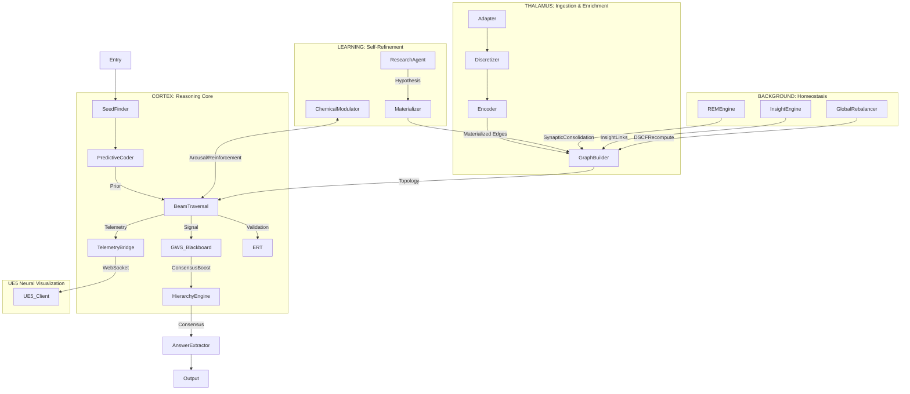

# CEREBRUM System Architecture

**Version**: v2.24.0 (Phase 111 COMPLETE)

Complete data-flow from ingestion to result, including all options, pathways, and decision nodes.

---

## Core Components

### Phase 110: Global Workspace (GWS)
Implements a blackboard-based competitive attention layer, replacing linear MACH escalation with dynamic signal bidding. Communities broadcast "surprise" signals to a shared Blackboard, and the `ConsensusHierarchyEngine` dynamically boosts candidates with high-novelty evidence before standard escalation occurs. This provides cognitive flexibility and pre-emption capabilities.

### Phase 111: Active Inference
Transforms reasoning from a reactive search to a proactive traversal. The `PredictiveCoder` generates "Expected Path" priors from Engram patterns, which bias the `BeamTraversal` toward likely sequences. Prediction Errors (PE) trigger metabolic arousal, allowing the system to focus computational energy on "surprising" discoveries.

## Legend

| Colour | Layer | Description |
|---|---|---|
| Dark green | THALAMUS | Ingestion, embedding, community detection |
| Dark blue | CORTEX | Traversal, attention scoring, answer extraction |
| Purple | Learning | Online SGD, batch retrain, temporal calibration, Engram pattern cache |
| Orange | Background | REM, InsightEngine, HypothesisEngine, Rebalancer, Stream |
| Teal | Persistence | State snapshots, QueryLog, Engram JSON, build caches |
| Olive | Output | Verbalization, response routing |
| Red | Entry | REST, CLI, UI, Federated, Stream |
| Grey | API | All REST endpoint groups |
| Yellow | Decision | Every branching/option node |
| Cyan | Visualization | TelemetryBridge, UE5 client, WebSocket stream |

## Key Decision Points

| Decision | Options | Effect |
|---|---|---|
| IngestionPipeline | on / off | entity normalization, dedup, relation canonicalization |
| STDPDiscretizer | on / off | causal edge inference from spike timing |
| SignalEncoder | on / off | cross-modal sensor → embedding space alignment |
| Embedding mode | random / sentence | random=fast+test; sentence=BGE-Small-v1.5 384-dim |
| GraphSAGE | on / off | neighbourhood smoothing enriches semantic (α) signal |
| Community engine | DSCF / TSC / Leiden / LPA | affects attention head structure |
| Coarsening | min_size / target_max / none | merges small communities |
| Traversal mode | standard / probabilistic / Engram | changes beam pruning strategy |
| Active Inference | proactive / reactive | biases beam toward projected Engram priors |
| Global Workspace | on / off | enables competitive signal bidding and pre-emption |
| Temporal filter | hard prune / soft decay | edges outside window rejected or penalised |
| CVT passthrough | on / off | Freebase mediator collapse for WebQSP |
| SymbolicValidator | on / off | per-step logical guardrail |
| CalibrationEngine | on / off | self-doubt entropy check per hop |
| RelationPathPrior | on / off | boosts known relation chain patterns |
| Engram | warm / cold | steers beam toward cached relation sequences |
| LoopedBeamTraversal | max_loops=1..N | applies traversal T times with inter-loop feedback |
| AutoApprover | attached / not | tiered auto-decision on ResearchFindings | 
| ProvenanceLedger | attached / not | per-batch edge recording; enables targeted rollback |
| GraphSnapshot | save / restore / diff | portable JSON topology persistence across restarts |
| Adaptive Loop Tuning | on / off | DiscoveryCalibrator-driven dynamic cap scaling | 
| TelemetryBridge | ws_port set / not set | WebSocket server for UE5 visualization |
| GUI Adaptation | on / off | metabolic-driven UI structural adaptation |
