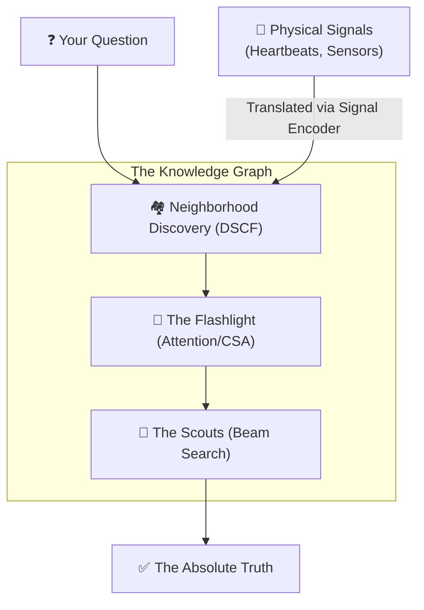

# CEREBRUM: The AI That Thinks for Itself
**A Guide to the Next Frontier of Knowledge Graph Reasoning**

---

### **Visualizing the Process: How CEREBRUM Thinks**

---

### **1. The Problem: The "Stochastic Parrot"**
If you’ve used ChatGPT, you know it's amazing. But you also know it sometimes **hallucinates**—it says things that sound perfectly confident but are completely wrong. Why? 

Because current AI is built on **probability**. It’s guessing the next most likely word in a sentence based on patterns it saw in trillions of pages of training data. It doesn't actually "know" facts; it just knows what facts *sound like*.

**CEREBRUM** is different. It doesn't guess. It **reasons** using a giant map of absolute truths.

---

### **2. The Library: What is a Knowledge Graph?**
Imagine a library where every book is a single fact, and every fact is connected to others by silk threads. 
- **Nodes**: The points (e.g., "Albert Einstein", "Physics", "Germany").
- **Edges**: The threads (e.g., "was born in", "studied", "involved in").

This is a **Knowledge Graph**. It’s a literal map of the world’s information. In this map, there is no "guessing"—either a connection exists, or it doesn't. CEREBRUM lives inside this map.

---

### **3. Neighborhoods: How CEREBRUM Finds Groups (DSCF)**
Think of a giant city. People who like the same music or work the same jobs tend to live in the same neighborhoods. 

In a Knowledge Graph, facts do the same thing. Medical facts cluster together; history facts cluster together. CEREBRUM uses an algorithm called **DSCF** (Dual-Signal Community Fusion) to automatically find these "neighborhoods." 

By grouping facts into communities, CEREBRUM can ignore the noise. When you ask a question about biology, it knows exactly which neighborhoods to visit and which ones to skip. 

---

### **4. The Flashlight: Paying Attention (CSA)**
When you look for your keys in a dark room, you don't look at everything at once. You use a flashlight.

CEREBRUM uses **CSA** (Community-Structured Attention) as its flashlight. When it’s trying to solve a puzzle, it calculates which path is most likely to be correct. It looks at:
- **Semantics**: Does this word "vibe" with the question?
- **Community**: Is this path in the right neighborhood?
- **Edges**: Is this a strong relationship (like "is father of") or a weak one?

By focusing its "flashlight" on the best paths, it can find answers in a fraction of a second, even in a graph with billions of connections.

---

### **5. Scouting for Truth: The Beam Search**
When CEREBRUM starts a search, it doesn't just walk one path. It sends out **scouts**. This is called **Beam Search**.

Imagine 50 scouts starting at a single point and fanning out across the city. Each scout reports back on how "promising" their path looks. The best scouts stay on the trail; the ones who hit dead ends are called back. Eventually, at least one scout finds the goal—and because they walked the path step-by-step, they can show you **exactly how they got there.**

---

### **6. Giving AI Senses: The Signal Encoder**
This is the most "sci-fi" part. Usually, AI only understands text or images. But what if we wanted it to understand a heartbeat, a seismic tremor, or a sensor on a space probe?

CEREBRUM’s **Signal Encoder** takes "raw ripples" from the physical world and turns them into "facts" on the graph. It uses a mathematical trick called **Orthogonal Procrustes** (named after a giant from Greek mythology!) to rotate the physical signal until it "fits" perfectly into the brain's symbolic map. 

Suddenly, a heartbeat isn't just a wave—it’s a node connected to "tachycardia" or "stress" in the reasoning engine.

---

### **7. Why This Matters: Reasoning Without a Teacher**
Most AIs need weeks of "training" on supercomputers. They cost millions of dollars to build.

**CEREBRUM is training-free.** You give it a map (the graph), and it handles the rest. 
- **Explainable**: You can see every step of the logic.
- **Fast**: It can think across thousands of nodes in milliseconds.
- **Scalable**: It can grow forever just by adding more facts to the map.

**CEREBRUM isn't just another chatbot. It’s a formal reasoning engine—a digital brain designed to find the absolute truth in a world of complex data.**

---
*For the technical details, read the official [CEREBRUM ArXiv Manuscript](file:///e:/Development/Parallax/docs/latex/cerebrum_master.pdf).*
