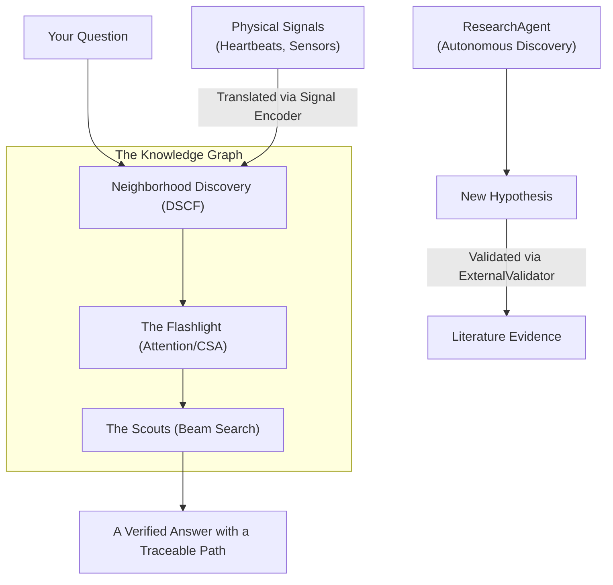

# CEREBRUM: The AI That Thinks for Itself
**A Guide to the Next Frontier of Knowledge Graph Reasoning**

---

### **Visualizing the Process: How CEREBRUM Thinks**

---

### **1. The Problem: The "Stochastic Parrot"**
If you've used ChatGPT, you know it's amazing. But you also know it sometimes **hallucinates** — it says things that sound perfectly confident but are completely wrong. Why?

Because current AI is built on **probability**. It's guessing the next most likely word in a sentence based on patterns it saw in trillions of pages of training data. It doesn't actually "know" facts; it just knows what facts *sound like*.

**CEREBRUM** is different. It doesn't guess. It **reasons** using a giant map of absolute truths.

---

### **2. The Library: What is a Knowledge Graph?**
Imagine a library where every book is a single fact, and every fact is connected to others by silk threads.
- **Nodes**: The points (e.g., "Albert Einstein", "Physics", "Germany").
- **Edges**: The threads (e.g., "was born in", "studied", "involved in").

This is a **Knowledge Graph**. It's a literal map of the world's information. In this map, there is no "guessing" — either a connection exists, or it doesn't. CEREBRUM lives inside this map.

---

### **3. Neighborhoods: How CEREBRUM Finds Groups (DSCF)**
Think of a giant city. People who like the same music or work the same jobs tend to live in the same neighborhoods.

In a Knowledge Graph, facts do the same thing. Medical facts cluster together; history facts cluster together. CEREBRUM uses an algorithm called **DSCF** (Dual-Signal Community Fusion) to automatically find these "neighborhoods."

By grouping facts into communities, CEREBRUM can ignore the noise. When you ask a question about biology, it knows exactly which neighborhoods to visit and which ones to skip.

---

### **4. The Flashlight: Paying Attention (CSA)**
When you look for your keys in a dark room, you don't look at everything at once. You use a flashlight.

CEREBRUM uses **CSA** (Community-Structured Attention) as its flashlight. When it's trying to solve a puzzle, it calculates which path is most likely to be correct. The flashlight has ten distinct lenses, each illuminating a different aspect of a fact:

1. **Semantics**: Does this fact "vibe" with the question? (cosine similarity)
2. **Community**: Is this path in the right neighborhood of the graph?
3. **Edge strength**: Is this a strong relationship (like "causes") or a weak one?
4. **Distance**: How far away is this fact? Further away means less likely.
5. **Hop decay**: Facts many steps away from the starting point lose confidence.
6. **PageRank authority**: Is this a well-connected, authoritative node?
7. **Temporal decay**: How recently was this fact established? Older facts fade slightly.
8. **Node recency**: Has this node been active in recent traversals?
9. **Synthesis density**: Was this fact generated by the system itself, or is it a hard-coded truth? The system trusts its own inventions a little less.
10. **Grounding confidence**: How strongly is this fact anchored to verified data?

Each of these ten lenses contributes to a single "attention score." CEREBRUM follows the brightest light.

---

### **5. Scouting for Truth: The Beam Search**
When CEREBRUM starts a search, it doesn't just walk one path. It sends out **scouts**. This is called **Beam Search**.

Imagine 50 scouts starting at a single point and fanning out across the city. Each scout reports back on how "promising" their path looks. The best scouts stay on the trail; the ones who hit dead ends are called back. Eventually, at least one scout finds the goal — and because they walked the path step-by-step, they can show you **exactly how they got there.**

---

### **6. Smart Scouting: Adaptive Search**
Here's a subtle problem: sometimes a neighborhood in the graph is packed with connections (like a busy city center), and sometimes it's sparse (like a remote countryside road).

Sending fifty scouts into a dense city center is overkill and wastes effort. Sending only five scouts down a remote road means you might miss the one path that leads somewhere interesting.

CEREBRUM now **automatically adjusts its scouting strategy** based on the local landscape. When it starts from a densely-connected node, it narrows the beam and moves quickly. When it starts from a sparsely-connected node, it widens the beam and explores more broadly. The system is reading the terrain as it goes.

---

### **7. Asking "Why?": The Hypothesis Engine**
Most reasoning systems answer the question "What is X?" CEREBRUM can now also answer "Why might X be happening?"

This is called **abductive reasoning** — the same kind of thinking a doctor uses when they see a set of symptoms and work backwards to find the most likely diagnosis.

When you observe something unexpected in your data, CEREBRUM's **HypothesisEngine** can trace multiple reverse paths through the graph simultaneously. It then fuses those paths into a ranked list of explanatory hypotheses, weighing the evidence from each path against the others. The most plausible explanations rise to the top.

Think of it as CEREBRUM working backwards: instead of "given A, what leads to B?" it asks "given B, what most plausibly caused A?"

---

### **8. Finding What's Missing: The Research Agent**
Knowledge Graphs are never complete. There are always hidden connections waiting to be discovered.

CEREBRUM's **ResearchAgent** is an autonomous discovery daemon — a background process that continuously monitors the graph looking for nodes that seem isolated or under-connected. When it finds them, it doesn't just flag them and stop. It runs multi-hop bridge analysis across the graph to propose specific edges that *could* plausibly exist but haven't been confirmed yet.

These proposed connections are queued for human review. A researcher can examine each proposal, see CEREBRUM's reasoning, and approve or reject it. This is not AI making things up — it is AI doing the legwork of scientific hypothesis generation, with a human in the loop before anything becomes fact.

---

### **9. Checking the Literature: The External Validator**
Once the ResearchAgent proposes a new connection, the next question is: does anything in the scientific literature support this?

The **ExternalValidator** answers that question automatically. When a new edge is proposed, it queries live scientific databases — PubMed, ClinicalTrials.gov, arXiv, and OpenAlex — and retrieves papers that are relevant to the proposed connection. It scores each proposal based on how much literature support it finds and returns citations alongside that score.

This means CEREBRUM can propose a hypothesis, search the global scientific literature, and hand a researcher both the graph-reasoning rationale and the real-world evidence for it, all without human effort.

---

### **10. Giving AI Senses: The Signal Encoder**
This is the most "sci-fi" part. Usually, AI only understands text or images. But what if we wanted it to understand a heartbeat, a seismic tremor, or a sensor on a space probe?

CEREBRUM's **Signal Encoder** takes "raw ripples" from the physical world and turns them into "facts" on the graph. It uses a mathematical trick called **Orthogonal Procrustes** (named after a giant from Greek mythology!) to rotate the physical signal until it "fits" perfectly into the brain's symbolic map.

Suddenly, a heartbeat isn't just a wave — it's a node connected to "tachycardia" or "stress" in the reasoning engine.

---

### **11. Watching CEREBRUM Think in Real Time**
One of the most common frustrations with AI systems is that they are black boxes — you ask a question, you get an answer, and you have no idea what happened in between.

CEREBRUM now has a full **observability layer**. Every decision, every beam step, every attention score is streamed into a circular log that captures the last 5,000 events in memory at all times. You can query this log through the API — or, if you open the dashboard interface, you can watch the reasoning process unfold in real time as a live feed.

This is not a debug tool — it is a first-class feature. In production, understanding *why* CEREBRUM reached a conclusion is just as important as the conclusion itself. The observability layer makes that possible without slowing the system down.

---

### **12. Why This Matters: Reasoning Without a Teacher**
Most AIs need weeks of "training" on supercomputers. They cost millions of dollars to build.

**CEREBRUM is training-free.** You give it a map (the graph), and it handles the rest.
- **Explainable**: You can see every step of the logic.
- **Fast**: It can think across thousands of nodes in milliseconds.
- **Scalable**: It can grow forever just by adding more facts to the map.
- **Adaptive**: It asks why, discovers what's missing, checks the literature, and watches itself think.

**CEREBRUM isn't just another chatbot. It's a formal reasoning engine — a digital brain designed to find the absolute truth in a world of complex data.**

---

### **What's New**

| Capability | What It Does | Why It Matters |
|---|---|---|
| HypothesisEngine | Asks "why did this happen?" by reasoning backwards through the graph | Abductive reasoning was previously only possible with LLMs or manual analysis |
| ResearchAgent | Autonomously looks for missing connections in the graph | Turns gap detection from a human chore into a continuous automated process |
| ExternalValidator | Checks proposed discoveries against PubMed, arXiv, ClinicalTrials, and OpenAlex | Scientific literature validation with zero human search effort |
| Adaptive Search | Automatically adjusts search depth based on how connected the local data is | Better results in both dense and sparse graph regions without manual tuning |
| Observability Dashboard | Real-time window into every reasoning step | Full transparency into production decisions |

---
*For the technical details, read the official [CEREBRUM ArXiv Manuscript](file:///e:/Development/Parallax/docs/latex/cerebrum_master.pdf).*
