# CEREBRUM System Architecture
## v2.73.0 (Phase 227) — All Controls and Data Transfers

```mermaid
flowchart TD

    %% ═══════════════════════════════════════════════════════════════════
    %% EXTERNAL
    %% ═══════════════════════════════════════════════════════════════════
    subgraph EXT["External"]
        KG["Knowledge Graph\nData Sources\n(CSV / Neo4j / RDF / SQL)"]
        USER["User / Client"]
        LIT["Literature &\nExternal APIs"]
    end

    %% ═══════════════════════════════════════════════════════════════════
    %% INTERFACE
    %% ═══════════════════════════════════════════════════════════════════
    subgraph IFACE["Interface"]
        API["FastAPI REST Server\n/query  /feedback  /retrain\n/rem/run  /research/*\n/graph/storage  /graph/edges"]
        CLI["CLI\ncerebrum query / serve"]
        STUDIO["StudioEngine\n(Gradio dashboard\n6 live panels)"]
    end

    %% ═══════════════════════════════════════════════════════════════════
    %% THALAMUS — INGESTION
    %% ═══════════════════════════════════════════════════════════════════
    subgraph THALAMUS["THALAMUS — Ingestion"]
        ADAPTER["GraphAdapter\n(NetworkX / MmapAdapter\nNeo4j / RDF / CSV)"]
        INGEST["IngestionPipeline\n(normalize / dedup\nconfidence / provenance)"]
        EMBED["EmbeddingEngine\n(RandomEngine\nSentenceEngine)"]
        GSAGE["GraphSAGE Smoother\n(1- or 2-layer mean agg)"]
        STRUCT["StructuralEncoder\n(PageRank / betweenness\n/ degree)"]
        STDP["STDPDiscretizer\n(causal edge inference\nfrom spike timing)"]
        SIGENC["SignalEncoder\n(StatisticalSignalEncoder\nSpectralSignalEncoder\nProcrustes SVD)"]
    end

    %% ═══════════════════════════════════════════════════════════════════
    %% PERSISTENT STORAGE
    %% ═══════════════════════════════════════════════════════════════════
    subgraph STORAGE["Persistent Storage (NVMe)"]
        WAL["GraphWAL\n(NDJSON append-only log\nedges.wal)"]
        MMAP["MmapConsolidator\n(graph.a / graph.e\nembeddings.e / graph.meta)"]
        QLOG["QueryLog\n(NDJSON query history)"]
        SNAP["GraphSnapshot\n(portable JSON topology)"]
    end

    %% ═══════════════════════════════════════════════════════════════════
    %% CORTEX — REASONING
    %% ═══════════════════════════════════════════════════════════════════
    subgraph CORTEX["CORTEX — Reasoning"]
        COMM["CommunityEngine\n(DSCF / TSC / Leiden / LPA)"]
        CSA["CSAEngine\n(10-param sigmoid attention\nα·sim + β·cs + γ·etw\n− δ·nd + ε·hd + ζ·pr\n+ η·td + ι·nr − μ·sd + θ·grnd)"]
        PROF["GraphProfiler\n(hub_homogeneous /\ntyped_heterogeneous / mixed\nauto-configures beam + hop)"]
        SRI["SRI + STRB\n(StructuralRelationInferrer\nSemantic Terminal Rel Boost)"]
        RLP["RelationPathPrior\n(pattern → hit/total counts)"]
        BT["BeamTraversal\n(H1SE / TAB / Bayesian\nGlobalBeamBarrier)"]
        LBT["LoopedBeamTraversal\n(LoopLM — T iterations\nseed expand + PE exit gate)"]
        PS["PathScorer"]
        AE["AnswerExtractor\n(Platt scaling\ncounterfactual rerank\ndeductive consensus rerank)"]
        ENG["Engram / SpeedTalk\n(relation pattern cache\nphonemic compression\nprefix query)"]
        MSTRAT["MultiStrategyConsensus\n(L1 local / L2 federated\n/ L3 gold-standard)"]
        CING["CingulateEngine\n(bilateral reverse\nverification rerank)"]
        FRONT["FrontalEngine\n(executive strategy select\nH1SE / TAB / standard)"]
    end

    %% ═══════════════════════════════════════════════════════════════════
    %% COGNITIVE ARCHITECTURE
    %% ═══════════════════════════════════════════════════════════════════
    subgraph COGARCH["Cognitive Architecture"]
        CERE["CerebellarEngine\n(dissonance detection\n→ ResearchAgent seeds)"]
        CHEM["ChemicalModulator\n(Dopamine / Norepinephrine\nAcetylcholine / Oxytocin\nVasopressin scalars)"]
        PRED["PredictiveCodingEngine\n(prior path from Engram\nPrediction Error PE\nsoliton_index)"]
        OSC["OscillationEngine\n(theta/gamma DSCF sync)"]
        SELF["SelfAwarenessEngine\n(7-dim epistemic\nself-assessment\nepistemic uncertainty)"]
        BIND["FastBindingEngine\n(one-shot episodic\nfast-path binding)"]
        IOR["InhibitionOfReturn\n(hyperbolic forgetting\nconflict monitoring\ncuriosity)"]
    end

    %% ═══════════════════════════════════════════════════════════════════
    %% ADAPTIVE LEARNING
    %% ═══════════════════════════════════════════════════════════════════
    subgraph LEARN["Adaptive Learning"]
        MML["MetaParameterLearner\n(online SGD per community\ntriplet margin loss)"]
        CPL["CSAParameterLearner\n(batch gradient descent\nglobal prior)"]
        PLATT["PlattCalibration\n(2-param sigmoid\nA·s + B fit)"]
        TCAL["TemporalCalibrator\n(grid-search η / ι\nvs Recall@K)"]
    end

    %% ═══════════════════════════════════════════════════════════════════
    %% REM ENGINE
    %% ═══════════════════════════════════════════════════════════════════
    subgraph REM["REM Engine"]
        SCO["SleepCycleOrchestrator\nPhase 1: EngramConsolidator\nPhase 2: WorkingMemory consolidate\nPhase 3: REMEngine\nPhase 4: SynapticDecay\nPhase 5: DefaultModeEngine\nPhase 6: NVMe flush"]
        REME["REMEngine\n(prune low-conf edges\nsynthesize wormholes\nconsolidate communities)"]
        BTWIN["BridgeTwinEngine\n(experience-dependent\nrelay node formation)"]
        MADV["MmapAdvisor\n(RAM pressure check\n20% / 50% thresholds\nAUTO / ALWAYS / NEVER)"]
    end

    %% ═══════════════════════════════════════════════════════════════════
    %% AUTONOMOUS RESEARCH
    %% ═══════════════════════════════════════════════════════════════════
    subgraph RESEARCH["Autonomous Research"]
        ADL["AutonomousDiscoveryLoop\n(circuit breaker\nper-cycle cap / dry-run\ncycle checkpoint)"]
        RA["ResearchAgent\n(missing-link discovery\n_revision_candidates)"]
        HYPO["HypothesisEngine\n(Noisy-OR abduction\nabductive paths)"]
        EV["ExternalValidator\n(literature verification\nrecency_score exp decay)"]
        TRI["TriangulationEngine\n(P1 reverse confidence\nP2 strategy agreement\nP3 path independence\nP4 semantic type)"]
        AA["AutoApprover\n(hard gates\n→ 16-feature logistic SGD\n→ LLM fallback)"]
        CR["ContradictionResolver\n(Noisy-OR evidence weight\nclean / contested /\ndiscardable)"]
        DC["DiscoveryCalibrator\n(EMA per-community rate\ninverse-rate multiplier\nlog nomination boost)"]
        PROV["ProvenanceLedger\n(batch_id / cycle rollback\nLRU eviction)"]
        CREG["CandidateRegistry\n(TTL-aware / nomination_count\nlog nomination_boost)"]
    end

    %% ═══════════════════════════════════════════════════════════════════
    %% VISUALIZATION
    %% ═══════════════════════════════════════════════════════════════════
    subgraph VIZ["Visualization"]
        TELEM["TelemetryBridge\n(WebSocket multiplex\nws://localhost:8765)"]
        UE5["UE5 CerebrumVisualizer\nACerebrumBrain (orchestrator)\nANeuronNodeActor (sphere)\nASynapseActor (cylinder)\nUCerebrumLink (WS bridge)"]
    end

    %% ═══════════════════════════════════════════════════════════════════
    %% ─── INGESTION FLOWS ──────────────────────────────────────────────
    %% ═══════════════════════════════════════════════════════════════════
    KG -->|raw edges & nodes| ADAPTER
    ADAPTER -->|graph object| INGEST
    INGEST -->|normalized entities & labels| EMBED
    INGEST -->|node set| STRUCT
    SIGENC -->|projected embeddings| EMBED
    STDP -->|causal edge directions| ADAPTER
    EMBED -->|base embeddings| GSAGE
    GSAGE -->|smoothed embeddings| CSA
    STRUCT -->|PR / betweenness / degree| CSA
    ADAPTER -->|graph topology| COMM

    %% ═══════════════════════════════════════════════════════════════════
    %% ─── INTERFACE → CORE ─────────────────────────────────────────────
    %% ═══════════════════════════════════════════════════════════════════
    USER -->|POST /query QueryRequest| API
    USER -->|POST /feedback| API
    USER -->|CLI commands| CLI
    CLI -->|build / query calls| ADAPTER
    API -->|query dispatch| LBT
    API -->|REM trigger| SCO
    API -->|research control start/stop/configure| ADL
    API -->|POST /retrain| CPL
    API -->|POST /feedback| MML
    API -->|GET /graph/edges pre-load| UE5
    STUDIO -->|live panel polling| API
    STUDIO -->|hot-swap graph| ADAPTER

    %% ═══════════════════════════════════════════════════════════════════
    %% ─── CORTEX REASONING FLOW ────────────────────────────────────────
    %% ═══════════════════════════════════════════════════════════════════
    COMM -->|community map + partition| CSA
    COMM -->|community map| PROF
    PROF -->|beam_width / hop / H1SE / TAB flags| BT
    SRI -->|terminal relation hint| BT
    RLP -->|relation pattern weights| BT
    ENG -->|affinity boost on _prune_candidates| BT
    IOR -->|visited-node penalty| BT
    CSA -->|edge attention weights| BT
    FRONT -->|strategy selection| BT
    MSTRAT -->|consensus strategy config| BT
    SELF -->|epistemic uncertainty → adaptive beam width| BT
    BT -->|beam paths| LBT
    LBT -->|iterated / merged paths| PS
    BT -->|direct paths| PS
    PS -->|scored paths| CING
    CING -->|reverse-verified paths| AE
    PLATT -->|calibrated score transform| AE
    AE -->|ranked answers| API
    AE -->|query record + relation sequence| QLOG
    QLOG -->|replay on startup| ENG

    %% ═══════════════════════════════════════════════════════════════════
    %% ─── COGNITIVE ARCHITECTURE FLOWS ─────────────────────────────────
    %% ═══════════════════════════════════════════════════════════════════
    AE -->|dissonant high-score low-consensus predictions| CERE
    CERE -->|dissonant seeds| RA
    LBT -->|prediction error PE per loop| PRED
    PRED -->|PE → arousal / novelty / reinforcement| CHEM
    PRED -->|pattern affinity boost| ENG
    CHEM -->|beam_width / branch adjustments| BT
    OSC -->|theta/gamma phase signal| COMM
    BIND -->|fast-path episodic shortcut| ENG
    IOR -->|hyperbolic forgetting curve| BT

    %% ═══════════════════════════════════════════════════════════════════
    %% ─── ADAPTIVE LEARNING FLOWS ──────────────────────────────────────
    %% ═══════════════════════════════════════════════════════════════════
    MML -->|community_overrides SGD update| CSA
    CPL -->|global prior gradient update| CSA
    AE -->|raw_score + correct label| PLATT
    TCAL -->|calibrated η / ι values| CSA

    %% ═══════════════════════════════════════════════════════════════════
    %% ─── REM / NVMe FLOWS ─────────────────────────────────────────────
    %% ═══════════════════════════════════════════════════════════════════
    SCO -->|phase 1-5 triggers| REME
    SCO -->|phase 6 flush callback| MMAP
    REME -->|on_complete callback| MMAP
    MADV -->|mmap recommendation use_mmap bool| MMAP
    REME -->|prune low-conf edges| ADAPTER
    REME -->|synthesize wormhole edges| ADAPTER
    BTWIN -->|bridge relay edges| ADAPTER
    ADAPTER -->|add_edge O1 append| WAL
    WAL -->|replay records on startup| ADAPTER
    MMAP -->|atomic write graph.a/.e/embeddings.e| STORAGE
    WAL -->|truncate after flush| WAL
    SNAP -->|restore topology| ADAPTER

    %% ═══════════════════════════════════════════════════════════════════
    %% ─── AUTONOMOUS RESEARCH FLOWS ────────────────────────────────────
    %% ═══════════════════════════════════════════════════════════════════
    ADL -->|timed scan trigger| RA
    ADL -->|circuit breaker state| AA
    RA -->|candidate pair| CREG
    CREG -->|TTL gate + nomination boost| HYPO
    HYPO -->|abductive traversal call| BT
    HYPO -->|hypothesis + path evidence| EV
    EV -->|literature query| LIT
    LIT -->|evidence + recency score| EV
    EV -->|validated finding + ValidationReport| RA
    RA -->|finding| TRI
    TRI -->|4-perspective TriangulationReport| AA
    CR -->|net_evidence_score + resolution| AA
    DC -->|community scan weight| RA
    DC -->|nomination weight| CREG
    AA -->|approved finding| PROV
    AA -->|approved edge| ADAPTER
    AA -->|rejected finding| CREG
    PROV -->|rollback_batch / rollback_cycle| ADAPTER
    ADL -->|auto_rollback on trip| PROV

    %% ═══════════════════════════════════════════════════════════════════
    %% ─── TELEMETRY / VISUALIZATION FLOWS ──────────────────────────────
    %% ═══════════════════════════════════════════════════════════════════
    BT -->|SYNAPTIC_PULSE per hop| TELEM
    REME -->|SYNAPTIC_PRUNE events| TELEM
    RA -->|SYNAPTOGENESIS events| TELEM
    INGEST -->|NEUROGENESIS events| TELEM
    TELEM -->|WebSocket event stream| UE5
```

---

## Layer Summary

| Layer | Key Components | Primary Role |
|-------|---------------|--------------|
| **THALAMUS** | GraphAdapter, IngestionPipeline, EmbeddingEngine, StructuralEncoder, STDPDiscretizer, SignalEncoder | Raw data → structured graph + embeddings |
| **CORTEX** | CommunityEngine, CSAEngine, BeamTraversal, LoopedBeam, PathScorer, AnswerExtractor, Engram | Multi-hop KG reasoning |
| **Cognitive** | CerebellarEngine, ChemicalModulator, PredictiveCodingEngine, OscillationEngine, SelfAwarenessEngine | Adaptive modulation of reasoning parameters |
| **Learning** | MetaParameterLearner, CSAParameterLearner, PlattCalibration, TemporalCalibrator | Online + batch parameter adaptation |
| **REM** | SleepCycleOrchestrator, REMEngine, BridgeTwinEngine, MmapAdvisor, MmapConsolidator | Graph consolidation + NVMe persistence |
| **Research** | AutonomousDiscoveryLoop, ResearchAgent, HypothesisEngine, AutoApprover, TriangulationEngine, ProvenanceLedger | Autonomous missing-link discovery + validation |
| **Storage** | GraphWAL, MmapConsolidator, QueryLog, GraphSnapshot | Crash-safe NVMe persistence |
| **Interface** | FastAPI, CLI, StudioEngine | Query intake + control plane |
| **Visualization** | TelemetryBridge, UE5 CerebrumVisualizer | Real-time 3D neural event rendering |

## Critical Data Paths

| Flow | Path |
|------|------|
| **Query (hot)** | User → API → LoopedBeamTraversal → BeamTraversal → CSAEngine → PathScorer → AnswerExtractor → API |
| **Learning loop** | User → POST /feedback → MetaParameterLearner → CSAEngine → next query |
| **REM / NVMe** | SleepCycleOrchestrator (phase 6) → MmapConsolidator → atomic rename → NVMe |
| **Crash recovery** | Startup → GraphWAL.replay(adapter) → graph restored |
| **Discovery** | AutonomousDiscoveryLoop → ResearchAgent → HypothesisEngine → BeamTraversal → ExternalValidator → AutoApprover → GraphAdapter |
| **Visualization** | BeamTraversal → SYNAPTIC_PULSE → TelemetryBridge → UE5 WebSocket |
